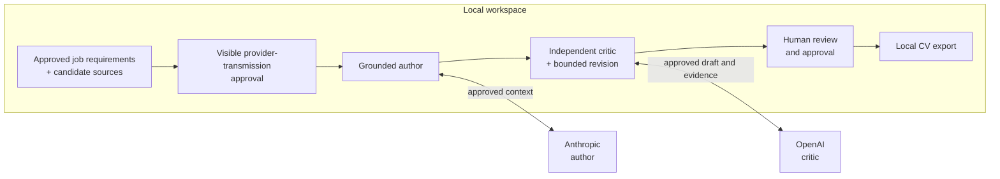
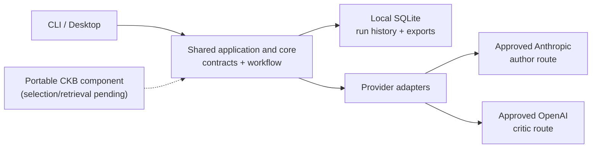

# DraftLoop

[](https://github.com/akoita/draft-loop/actions/workflows/ci.yml)


DraftLoop turns candidate-owned sources into a job-specific CV with local-first
grounding, independent AI critique, and final human control.

It is designed for candidates who want useful drafting assistance without giving
up traceability or control of their source material. Claims remain connected to
candidate-provided evidence, provider and model identities are visible, and the
candidate decides what to approve and export.

> **Alpha status:** v0.6.0 is a released, non-validated alpha. Its representative
> outcome was not application-ready: it missed important CV structure and
> chronology and introduced unsupported content. The current stage is **v0.7
> Evidence-backed CV drafting**, the first increment toward application-ready
> parity; independent review/readiness follows in v0.8 and parity evidence in
> v0.9. This project is not production-ready.

## How DraftLoop works

The workflow keeps the job description and candidate sources in a local
workspace, then uses a bounded author–critic loop to improve a draft. The
default cross-company pairing is Anthropic as author and OpenAI as critic.



The loop is an assistant, not an authority. DraftLoop does not independently
verify a career, contact past employers, replace interviews, or turn a
candidate's source material into permission to invent facts.

## Try the alpha desktop build

Download the [v0.6.0 release](https://github.com/akoita/draft-loop/releases/tag/v0.6.0)
and its `SHA256SUMS` file. The release currently provides these unsigned ZIPs:

- Linux x64
- macOS arm64
- Windows x64

To verify one download, replace `<downloaded-archive>.zip` below with the ZIP
you selected and compare that single digest with its matching line in
`SHA256SUMS`:

```sh
# Linux
sha256sum "./<downloaded-archive>.zip"

# macOS
shasum -a 256 "./<downloaded-archive>.zip"
```

On Windows, run `(Get-FileHash .\your-download.zip -Algorithm SHA256).Hash` in
PowerShell and compare that output with the matching `SHA256SUMS` entry. Extract
the matching ZIP and launch the desktop executable from the extracted folder.
These are alpha test builds, not dependable real-application tooling; signing, updates, and
application-readiness validation are still ahead. The CLI is source-only during
the alpha stage and has no standalone installer.

## Developer quick start

Use Node.js **24.5.0** and pnpm **10.18.3**:

```sh
pnpm install --frozen-lockfile
```

Start the desktop shell and choose **Try demo workspace** to exercise the
deterministic fixture workflow:

```sh
pnpm --filter @draft-loop/desktop start
```

Fixture mode is offline and uses no provider spend. To inspect the source-only
CLI:

```sh
pnpm --filter @draft-loop/cli start --help
```

Live use requires an explicit provider-transmission approval in the workspace,
configured provider credentials, and may incur provider cost. Keep real
candidate material out of the repository.

For the normal quality gate, run:

```sh
pnpm format:check
pnpm lint
pnpm typecheck
pnpm test
```

## Technology and architecture

| Area | Technology or boundary |
| --- | --- |
| Runtime | TypeScript, Node.js 24.5.0, pnpm 10.18.3 |
| User interfaces | React 19, Vite, Electron 43; source-only Commander CLI |
| Product core | Framework-free domain contracts, Zod schemas, orchestrator ports |
| Providers | Explicit Anthropic and OpenAI SDK adapters |
| Local data and output | SQLite via Drizzle ORM; Markdown, PDF, and DOCX exports |
| Quality | Biome, ESLint, Markdownlint, Vitest, GitHub Actions |



The portable Candidate Knowledge Base (CKB) component can store approved local
source versions, but CKB selection and retrieval are not yet integrated into the
user workflow. The existing workspace evidence path remains authoritative for
application runs; the CKB should not be assumed to supply an application run.

## Trust boundary

- Source material, run history, and exports are local by default.
- A provider receives only context covered by an explicit user approval; the
  workspace shows the provider, model, transmission scope, and retention choice.
- Independent review is a product constraint: the default author and critic use
  different provider companies, and their identities are recorded.
- DraftLoop prepares local artifacts. It does not submit applications, publish
  documents, send messages, or perform uncontrolled web research on a user's
  behalf.

## Documentation

- [Roadmap and current status](docs/roadmap.md) · [v0.6.0 stage evidence](docs/stage-evidence-v0.6.0.md)
- [Architecture](docs/architecture.md) · [Architecture decision records](docs/adr/)
- [Privacy and evaluation](docs/privacy-and-evaluation.md) · [Threat model](docs/threat-model.md)
- [Contributing](CONTRIBUTING.md) · [Releasing](docs/releasing.md)

Human approval is mandatory before an artifact is exported. DraftLoop can help
prepare a CV, but the candidate remains responsible for factual review, final
approval, and every action outside the local workspace.
