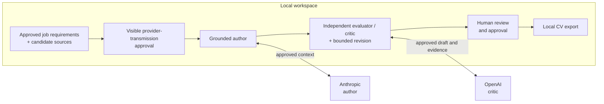
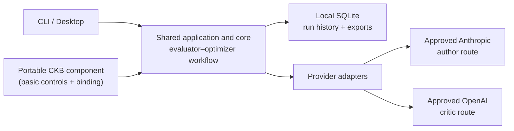

# DraftLoop

[](https://github.com/akoita/draft-loop/actions/workflows/ci.yml)


DraftLoop turns candidate-owned sources into a job-specific CV with local-first
grounding, independent AI critique, and final human control.

It is designed for candidates who want useful drafting assistance without giving
up traceability or control of their source material. Claims remain connected to
candidate-provided evidence, provider and model identities are visible, and the
candidate decides what to approve and export.

> **Current maturity:** DraftLoop is an alpha local-first workflow. The
> [roadmap and current status](docs/roadmap.md) record its maturity, evidence,
> and remaining gaps. This project is not production-ready.

## How DraftLoop works

The workflow keeps the job description and candidate sources in a local
workspace, then applies an evidence-grounded
[evaluator–optimizer workflow](https://github.com/anthropics/claude-cookbooks/blob/main/patterns/agents/evaluator_optimizer.ipynb):
an author generates, an independent critic evaluates against a rubric, and
accepted feedback drives bounded revision. The default cross-company pairing is
Anthropic as author and OpenAI as critic. [ADR 0003](docs/adr/0003-evidence-grounded-evaluator-optimizer.md)
records DraftLoop's adaptation and controls.



The loop is an assistant, not an authority. DraftLoop does not independently
verify a career, contact past employers, replace interviews, or turn a
candidate's source material into permission to invent facts.

## Try the alpha desktop build

Download the [newest release compatible with your platform](https://github.com/akoita/draft-loop/releases)
and its `SHA256SUMS` file. Desktop packages are distributed as platform-specific
ZIP archives, including Windows x64. The releases page is authoritative for the
current platform set and release limitations.

To verify one download, replace `<downloaded-archive>.zip` below with the ZIP
you selected and compare that single digest with its matching line in
`SHA256SUMS`:

```sh
# Linux
sha256sum "./<downloaded-archive>.zip"

# macOS
shasum -a 256 "./<downloaded-archive>.zip"
```

On Windows, run `(Get-FileHash .\your-download.zip -Algorithm SHA256).Hash` in
PowerShell and compare that output with the matching `SHA256SUMS` entry. Extract
the matching ZIP and launch the desktop executable from the extracted folder.
These are alpha test packages, not signed installers or dependable
real-application tooling; signing, updates, and application-readiness validation
are still ahead. The CLI is a separate, source-only interface and has no
standalone installer.

## Developer quick start

Use Node.js **24.5.0** and pnpm **10.18.3**:

```sh
pnpm install --frozen-lockfile
```

Start the desktop shell and choose **Try demo workspace** to exercise the
deterministic fixture workflow:

```sh
pnpm --filter @draft-loop/desktop start
```

Fixture mode is offline and uses no provider spend. To inspect the source-only
CLI:

```sh
pnpm --filter @draft-loop/cli start --help
```

The CLI exposes shared CKB controls through `knowledge`: initialize a portable
store with its default CKB, open or list a store, inspect path-free lifecycle
readiness, list path-free source/version identities, report duplicate groups,
inspect the count-only managed-file inventory, and import an explicitly chosen
local file, bounded local directory, or explicitly approved HTTPS URL. A later
local file version can be appended to an existing file source without replacing
its remembered origin.
The CLI can also bind one or more ready CKBs to a workspace; combining CKBs
requires `--approve-combination`. For example:

```sh
pnpm --filter @draft-loop/cli start knowledge store init ./candidate-knowledge
pnpm --filter @draft-loop/cli start knowledge store list ./candidate-knowledge
pnpm --filter @draft-loop/cli start knowledge store inventory ./candidate-knowledge
pnpm --filter @draft-loop/cli start knowledge base create ./candidate-knowledge "Public projects"
pnpm --filter @draft-loop/cli start knowledge source import \
  ./candidate-knowledge KNOWLEDGE_BASE_ID ./career-history.md
pnpm --filter @draft-loop/cli start knowledge source import-directory \
  ./candidate-knowledge KNOWLEDGE_BASE_ID ./career-material
pnpm --filter @draft-loop/cli start knowledge source import-url \
  ./candidate-knowledge KNOWLEDGE_BASE_ID https://example.com/profile --approve
pnpm --filter @draft-loop/cli start knowledge source append-file-version \
  ./candidate-knowledge KNOWLEDGE_BASE_ID SOURCE_ID ./updated-career-history.md
pnpm --filter @draft-loop/cli start knowledge source origin-status \
  ./candidate-knowledge KNOWLEDGE_BASE_ID SOURCE_ID
pnpm --filter @draft-loop/cli start knowledge source refresh-file \
  ./candidate-knowledge KNOWLEDGE_BASE_ID SOURCE_ID
pnpm --filter @draft-loop/cli start knowledge source refresh-url \
  ./candidate-knowledge KNOWLEDGE_BASE_ID SOURCE_ID --approve
pnpm --filter @draft-loop/cli start knowledge source rebind-file \
  ./candidate-knowledge KNOWLEDGE_BASE_ID SOURCE_ID ./relocated-career-history.md
pnpm --filter @draft-loop/cli start knowledge source retirement-state \
  ./candidate-knowledge KNOWLEDGE_BASE_ID SOURCE_ID
pnpm --filter @draft-loop/cli start knowledge source retire \
  ./candidate-knowledge KNOWLEDGE_BASE_ID SOURCE_ID --confirm
pnpm --filter @draft-loop/cli start knowledge source directory-rebind-preview \
  ./candidate-knowledge KNOWLEDGE_BASE_ID DIRECTORY_ID ./relocated-career-material
pnpm --filter @draft-loop/cli start knowledge source directory-rebind-apply \
  ./candidate-knowledge KNOWLEDGE_BASE_ID DIRECTORY_ID ./relocated-career-material --confirm
pnpm --filter @draft-loop/cli start knowledge source directory-refresh-preview \
  ./candidate-knowledge KNOWLEDGE_BASE_ID DIRECTORY_ID
pnpm --filter @draft-loop/cli start knowledge source directory-refresh-apply \
  ./candidate-knowledge KNOWLEDGE_BASE_ID DIRECTORY_ID --confirm
pnpm --filter @draft-loop/cli start knowledge source list \
  ./candidate-knowledge KNOWLEDGE_BASE_ID
pnpm --filter @draft-loop/cli start knowledge source duplicates \
  ./candidate-knowledge KNOWLEDGE_BASE_ID
pnpm --filter @draft-loop/cli start knowledge select ./workspace \
  ./candidate-knowledge KNOWLEDGE_BASE_ID
```

The desktop native boundary exposes the same operations without accepting or
returning filesystem paths in renderer messages. Desktop selection accepts only
stores explicitly opened in the current session and requires the same visible
approval for combinations. Both adapters can create, rename, and archive
additional CKBs and expose the same bounded source, duplicate, and structural
inventory inspection contracts. These generic diagnostics omit roots, source
labels, filenames, URLs, checksums, and content. Archival requires explicit
confirmation and cannot target the default CKB. Single-file intake uses a
dedicated native picker, keeps the selected path in the host, and returns only
opaque source/version identity. URL intake requires explicit approval, applies
the shared HTTPS and network-safety checks, and likewise returns no URL or
content. File-version append uses the same native picker, preserves the existing
origin binding, and reports whether immutable managed bytes created a new
version or matched the current one. Path-free status and refresh-state controls
inspect remembered lifecycle evidence. File refresh uses the remembered local
origin; URL refresh requires fresh approval and the same network-safety checks
as intake. Directory intake uses the same bounded application contract: CLI
users choose a local directory path, while the desktop host owns a dedicated
native directory picker. Complete and partial results report only scan counts
and opaque source/version identities; roots, filenames, labels, hashes, and
content remain local. Exact-byte file-origin rebind uses runtime-only CLI input
or the native desktop picker and returns only status plus the binding timestamp.
Logical source retirement is idempotent, preserves evidence, and requires
explicit confirmation; there is no reactivation control. Directory-root
rebind uses separate bounded preview and confirmed apply commands. Apply
rescans the selected root and atomically updates member origins only when every
historical member still matches exactly. Directory refresh likewise separates
read-only preview from confirmed apply. Apply rescans the remembered root,
records current and missing observations, and appends changed same-member bytes
in source-ID order; a later failure reports bounded path-free partial progress.
Adding members, reconciliation, deletion, backup, and restore remain staged.

Live use requires an explicit provider-transmission approval in the workspace,
configured provider credentials, and may incur provider cost. Keep real
candidate material out of the repository.

For the normal quality gate, run:

```sh
pnpm format:check
pnpm lint
pnpm typecheck
pnpm test
pnpm validate
```

## Technology and architecture

| Area                  | Technology or boundary                                           |
| --------------------- | ---------------------------------------------------------------- |
| Runtime               | TypeScript, Node.js 24.5.0, pnpm 10.18.3                         |
| User interfaces       | React 19, Vite, Electron 43; source-only Commander CLI           |
| Product core          | Framework-free domain contracts, Zod schemas, orchestrator ports |
| Providers             | Explicit Anthropic and OpenAI SDK adapters                       |
| Local data and output | SQLite via Drizzle ORM; Markdown, PDF, and DOCX exports          |
| Quality               | Biome, ESLint, Markdownlint, Vitest, GitHub Actions              |



The portable Candidate Knowledge Base (CKB) component can store approved local
source versions. CLI and desktop adapters can create, open, list, and inspect
stores; workspaces can also bind explicit store/base snapshots with drift
checks. Retrieval does not yet consume those snapshots, so the existing
workspace evidence path remains authoritative for application runs.

## Trust boundary

- Source material, run history, and exports are local by default.
- A provider receives only context covered by an explicit user approval; the
  workspace shows the provider, model, transmission scope, and retention choice.
- Independent review is a product constraint: the default author and critic use
  different provider companies, and their identities are recorded.
- DraftLoop prepares local artifacts. It does not submit applications, publish
  documents, send messages, or perform uncontrolled web research on a user's
  behalf.

## Documentation

- [Roadmap and current status](docs/roadmap.md) · [Release history](https://github.com/akoita/draft-loop/releases) · [Stage evidence](docs/roadmap.md#stage-evidence)
- [Architecture](docs/architecture.md) · [Architecture decision records](docs/adr/)
- [Privacy and evaluation](docs/privacy-and-evaluation.md) · [Threat model](docs/threat-model.md)
- [Contributing](CONTRIBUTING.md) · [Releasing](docs/releasing.md)

Human approval is mandatory before an artifact is exported. DraftLoop can help
prepare a CV, but the candidate remains responsible for factual review, final
approval, and every action outside the local workspace.
