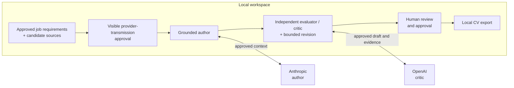
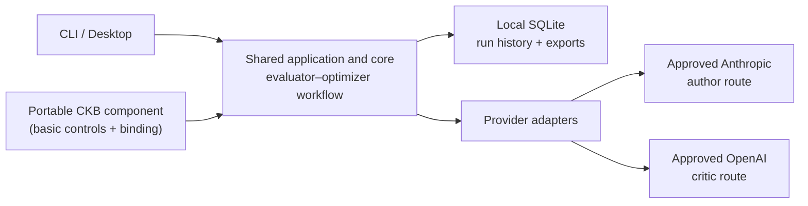

# DraftLoop

[](https://github.com/akoita/draft-loop/actions/workflows/ci.yml)


DraftLoop turns candidate-owned sources into a job-specific CV with local-first
grounding, independent AI critique, and final human control.

It is designed for candidates who want useful drafting assistance without giving
up traceability or control of their source material. Claims remain connected to
candidate-provided evidence, provider and model identities are visible, and the
candidate decides what to approve and export.

> **Current maturity:** DraftLoop is the `v0.8.0-alpha.1` Usable CV MVP
> stage-exit candidate. Its bounded capabilities are integrated and
> deterministically validated, but no representative consented outcome has
> been recorded. The [roadmap and current status](docs/roadmap.md) record its
> evidence and remaining gaps. This project is not production-ready.

## How DraftLoop works

The workflow keeps the job description and candidate sources in a local
workspace, then applies an evidence-grounded
[evaluator–optimizer workflow](https://github.com/anthropics/claude-cookbooks/blob/main/patterns/agents/evaluator_optimizer.ipynb):
an author generates, an independent critic evaluates against a rubric, and
accepted feedback drives bounded revision. The default cross-company pairing is
Anthropic as author and OpenAI as critic. [ADR 0003](docs/adr/0003-evidence-grounded-evaluator-optimizer.md)
records DraftLoop's adaptation and controls.



The loop is an assistant, not an authority. DraftLoop does not independently
verify a career, contact past employers, replace interviews, or turn a
candidate's source material into permission to invent facts.

## Try the v0.8 alpha desktop build

Download the [newest release compatible with your platform](https://github.com/akoita/draft-loop/releases)
and its `SHA256SUMS` file. Desktop packages are distributed as platform-specific
ZIP archives, including Windows x64. The releases page is authoritative for the
current platform set and release limitations.

To verify one download, replace `<downloaded-archive>.zip` below with the ZIP
you selected and compare that single digest with its matching line in
`SHA256SUMS`:

```sh
# Linux
sha256sum "./<downloaded-archive>.zip"

# macOS
shasum -a 256 "./<downloaded-archive>.zip"
```

On Windows, run `(Get-FileHash .\your-download.zip -Algorithm SHA256).Hash` in
PowerShell and compare that output with the matching `SHA256SUMS` entry. Extract
the matching ZIP and launch the desktop executable from the extracted folder.
These are v0.8 alpha stage-exit candidate packages, not signed installers or
dependable real-application tooling; no representative consented outcome has
been recorded, and signing and automatic updates remain ahead. The CLI is a
separate, source-only interface and has no standalone installer.

## Developer quick start

Use Node.js **24.5.0** and pnpm **10.18.3**:

```sh
pnpm install --frozen-lockfile
```

Start the desktop shell and choose **Try demo workspace** to exercise the
deterministic fixture workflow:

```sh
pnpm --filter @draft-loop/desktop start
```

Fixture mode is offline and uses no provider spend. To inspect the source-only
CLI:

```sh
pnpm --filter @draft-loop/cli start --help
```

The `opportunity` command group creates and reloads one durable brief, lists
its immutable versions, and creates edited or reviewed successors. Creation
reads a JSON manifest containing an `id` and ordered `sources`; local-file
paths exist only in that runtime input. Add `--allow-provider-data` only when
the source text may be sent to the configured author model for structured
extraction.

```sh
pnpm --filter @draft-loop/cli start opportunity create ./workspace \
  --input ./opportunity.json --allow-provider-data
pnpm --filter @draft-loop/cli start opportunity get ./workspace \
  --brief-id target-role
pnpm --filter @draft-loop/cli start opportunity edit ./workspace \
  --brief-id target-role --expected-version 1 --patch ./opportunity-patch.json
pnpm --filter @draft-loop/cli start opportunity review ./workspace \
  --brief-id target-role --expected-version 2
pnpm --filter @draft-loop/cli start start ./workspace \
  --opportunity-brief-id target-role --opportunity-version 3 \
  --candidate-profile-id default-profile --candidate-profile-version 3 \
  --allow-provider-data
```

`start` accepts each brief or candidate-profile ID and version only as a pair.
Each selected version must already be reviewed. DraftLoop verifies and pins
the exact immutable versions and their checksums in run context; later edits do
not change a started or resumed run. Starts that predate canonical profiles
remain supported without a profile selection.

The `profile` command group derives a canonical candidate profile from the
workspace's configured CKB selection, reloads exact or latest versions, and
creates immutable edited or reviewed successors. Derivation is the only
provider-backed operation and requires `--allow-provider-data`; the other
commands operate on workspace-local history. Profile commands never accept a
CKB store root. A draft can become reviewed, and a reviewed version can enter a
new run, only while its exact CKB selection still matches the workspace's
current lifecycle-ready selection. Historical profile versions and existing
run/export records remain available for audit after lifecycle changes.

```sh
pnpm --filter @draft-loop/cli start profile derive ./workspace \
  --profile-id default-profile --allow-provider-data
pnpm --filter @draft-loop/cli start profile get ./workspace \
  --profile-id default-profile
pnpm --filter @draft-loop/cli start profile edit ./workspace \
  --profile-id default-profile --expected-version 1 --patch ./profile-patch.json
pnpm --filter @draft-loop/cli start profile review ./workspace \
  --profile-id default-profile --expected-version 2
```

The packaged desktop host exposes the same five profile operations through its
validated native capability boundary. Renderer commands use the active
workspace identity, never accept a CKB root or open a profile-specific picker,
and receive an explicit bounded projection of facts, issues, and opaque source
references. The collecting workspace includes a dedicated profile surface for
derivation approval, immutable version selection, fact-value and issue-status
editing, review, and exact reviewed-version selection for the next run.

Writing policies are local, immutable versions. `policy activate` imports a
file and makes it the workspace default for future runs; `policy import` adds a
version without changing that default. Metadata-only reads are the default, and
exact local content is printed only when `--content` is supplied.

```sh
pnpm --filter @draft-loop/cli start policy activate ./writing-policy.md ./workspace
pnpm --filter @draft-loop/cli start policy import ./opportunity-policy.md ./workspace
pnpm --filter @draft-loop/cli start policy current ./workspace
pnpm --filter @draft-loop/cli start policy list ./workspace
pnpm --filter @draft-loop/cli start policy show <checksum> ./workspace --content
```

A policy may contain `Tone`, `Spelling locale`, `Verbosity`, `Page target`,
`Section order`, `Emphasis areas`, and `Anti-formulaic defaults` directives in
`Name: value` form, alongside forbidden-term and punctuation rules. The
anti-formulaic defaults are transparent and enabled unless the policy says
`Anti-formulaic defaults: disabled`.

An imported version can be selected as a complete override for one reviewed
opportunity. The active workspace policy is unchanged, and the run records both
base and override versions:

```sh
pnpm --filter @draft-loop/cli start start ./workspace \
  --opportunity-brief-id target-role --opportunity-version 3 \
  --writing-policy-override <checksum> --allow-provider-data
```

The CLI exposes shared CKB controls through `knowledge`: initialize a portable
store with its default CKB, open or list a store, inspect path-free lifecycle
readiness, list path-free source/version identities, report duplicate groups,
inspect the count-only managed-file inventory, and import an explicitly chosen
local file, bounded local directory, or explicitly approved HTTPS URL. A later
local file version can be appended to an existing file source without replacing
its remembered origin.
The CLI can also bind one or more ready CKBs to a workspace; combining CKBs
requires `--approve-combination`. For example:

```sh
pnpm --filter @draft-loop/cli start knowledge store init ./candidate-knowledge
pnpm --filter @draft-loop/cli start knowledge store list ./candidate-knowledge
pnpm --filter @draft-loop/cli start knowledge store inventory ./candidate-knowledge
pnpm --filter @draft-loop/cli start knowledge store backup \
  ./candidate-knowledge ./candidate-knowledge-backup --yes
pnpm --filter @draft-loop/cli start knowledge store inspect-backup \
  ./candidate-knowledge-backup
pnpm --filter @draft-loop/cli start knowledge store restore \
  ./candidate-knowledge-backup ./restored-candidate-knowledge \
  --collision fail-if-destination-exists --yes
pnpm --filter @draft-loop/cli start knowledge base create ./candidate-knowledge "Public projects"
pnpm --filter @draft-loop/cli start knowledge base archive \
  ./candidate-knowledge KNOWLEDGE_BASE_ID --confirm
pnpm --filter @draft-loop/cli start knowledge base delete-preview \
  ./candidate-knowledge KNOWLEDGE_BASE_ID
pnpm --filter @draft-loop/cli start knowledge base delete \
  ./candidate-knowledge KNOWLEDGE_BASE_ID \
  --confirmation-token TOKEN_FROM_PREVIEW --yes
pnpm --filter @draft-loop/cli start knowledge source import \
  ./candidate-knowledge KNOWLEDGE_BASE_ID ./career-history.md
pnpm --filter @draft-loop/cli start knowledge source import-directory \
  ./candidate-knowledge KNOWLEDGE_BASE_ID ./career-material
pnpm --filter @draft-loop/cli start knowledge source import-url \
  ./candidate-knowledge KNOWLEDGE_BASE_ID https://example.com/profile --approve
pnpm --filter @draft-loop/cli start knowledge source append-file-version \
  ./candidate-knowledge KNOWLEDGE_BASE_ID SOURCE_ID ./updated-career-history.md
pnpm --filter @draft-loop/cli start knowledge source origin-status \
  ./candidate-knowledge KNOWLEDGE_BASE_ID SOURCE_ID
pnpm --filter @draft-loop/cli start knowledge source refresh-file \
  ./candidate-knowledge KNOWLEDGE_BASE_ID SOURCE_ID
pnpm --filter @draft-loop/cli start knowledge source refresh-url \
  ./candidate-knowledge KNOWLEDGE_BASE_ID SOURCE_ID --approve
pnpm --filter @draft-loop/cli start knowledge source rebind-file \
  ./candidate-knowledge KNOWLEDGE_BASE_ID SOURCE_ID ./relocated-career-history.md
pnpm --filter @draft-loop/cli start knowledge source retirement-state \
  ./candidate-knowledge KNOWLEDGE_BASE_ID SOURCE_ID
pnpm --filter @draft-loop/cli start knowledge source retire \
  ./candidate-knowledge KNOWLEDGE_BASE_ID SOURCE_ID --confirm
pnpm --filter @draft-loop/cli start knowledge source directory-rebind-preview \
  ./candidate-knowledge KNOWLEDGE_BASE_ID DIRECTORY_ID ./relocated-career-material
pnpm --filter @draft-loop/cli start knowledge source directory-rebind-apply \
  ./candidate-knowledge KNOWLEDGE_BASE_ID DIRECTORY_ID ./relocated-career-material --confirm
pnpm --filter @draft-loop/cli start knowledge source directory-refresh-preview \
  ./candidate-knowledge KNOWLEDGE_BASE_ID DIRECTORY_ID
pnpm --filter @draft-loop/cli start knowledge source directory-refresh-apply \
  ./candidate-knowledge KNOWLEDGE_BASE_ID DIRECTORY_ID --confirm
pnpm --filter @draft-loop/cli start knowledge source directory-moved-candidates \
  ./candidate-knowledge KNOWLEDGE_BASE_ID DIRECTORY_ID
pnpm --filter @draft-loop/cli start knowledge source directory-member-move \
  ./candidate-knowledge KNOWLEDGE_BASE_ID DIRECTORY_ID SOURCE_ID --confirm
pnpm --filter @draft-loop/cli start knowledge source directory-reconciliation-preview \
  ./candidate-knowledge KNOWLEDGE_BASE_ID DIRECTORY_ID
pnpm --filter @draft-loop/cli start knowledge source directory-reconciliation-apply \
  ./candidate-knowledge KNOWLEDGE_BASE_ID DIRECTORY_ID \
  --approved-retirement-source-id SOURCE_ID --confirm
pnpm --filter @draft-loop/cli start knowledge source directory-add-members \
  ./candidate-knowledge KNOWLEDGE_BASE_ID DIRECTORY_ID --confirm
pnpm --filter @draft-loop/cli start knowledge source list \
  ./candidate-knowledge KNOWLEDGE_BASE_ID
pnpm --filter @draft-loop/cli start knowledge source duplicates \
  ./candidate-knowledge KNOWLEDGE_BASE_ID
pnpm --filter @draft-loop/cli start knowledge select ./workspace \
  ./candidate-knowledge KNOWLEDGE_BASE_ID
```

### Desktop knowledge operations

The desktop exposes the same CKB operations through a native boundary. Renderer
messages never accept or return filesystem paths; the host owns native pickers
and keeps paths local.

- **Store access and inspection.** Desktop selection accepts only stores opened
  in the current session. Combining CKBs requires visible approval. Both the CLI
  and desktop can create, rename, and archive additional CKBs, while bounded
  diagnostics omit roots, labels, filenames, URLs, checksums, and content.
  Archival requires confirmation and cannot target the default CKB.

- **File and URL intake.** Single-file intake uses a dedicated native picker and
  returns only opaque source and version identities. URL intake requires
  approval and applies the shared HTTPS and network-safety checks without
  returning the URL or its content.

- **Versions, status, and refresh.** Appending a file version preserves its
  origin binding and reports whether the managed bytes created a version or
  matched the current one. Path-free controls expose lifecycle and refresh
  state. File refresh uses the remembered origin; URL refresh requires fresh
  approval and repeats the intake safety checks.

- **File rebinding and retirement.** Exact-byte origin rebinding uses
  runtime-only CLI input or the native desktop picker and returns only status
  and the binding timestamp. Logical retirement is idempotent, preserves
  evidence, and requires confirmation. Retired sources cannot be reactivated.

- **Directory intake.** CLI users choose a local path, while the desktop uses a
  dedicated native directory picker. Complete and partial results contain only
  scan counts and opaque source or version identities; roots, filenames, labels,
  hashes, and content remain local.

- **Directory rebinding.** Preview and confirmed apply are separate operations.
  Apply rescans the selected root and updates member origins atomically only
  when every historical member still matches exactly.

- **Directory refresh and additions.** Refresh separates read-only preview from
  confirmed apply. Apply records current and missing observations and appends
  changed same-member bytes in source-ID order. Adding members also requires
  confirmation. Both operations report deterministic, path-free complete or
  partial progress.

- **Moved members and reconciliation.** Moved-candidate preview returns only
  unique exact-integrity matches. A confirmed member move rescans the directory,
  changes only the selected origin, and returns `moved` or idempotent `current`.
  Reconciliation retires only explicitly approved missing members, and never
  retires sources after an incomplete scan.

- **Portable backup and restore.** Export requires an approved new destination
  and returns path-free integrity counts. Restore re-verifies the package and
  publishes only to an approved new store with the explicit
  `fail-if-destination-exists` policy. Logical identities are preserved, but all
  sources remain unbound from their original machine.

Portable packages exclude machine-local origins, active locks, recovery
journals, application or provider credentials, and unrelated workspace data.
Confirmed deletion is limited to archived non-default CKBs and requires the
exact token from a fresh path-free preview. DraftLoop removes only ownership-
verified managed data, preserves unknown filesystem entries, and blocks on
unmanaged database records or active preservation overrides. External backups,
exports, and copies remain independent user-controlled data.

Live use requires an explicit provider-transmission approval in the workspace,
configured provider credentials, and may incur provider cost. Keep real
candidate material out of the repository.

For the normal quality gate, run:

```sh
pnpm format:check
pnpm lint
pnpm typecheck
pnpm test
pnpm validate
```

## Technology and architecture

| Area                  | Technology or boundary                                           |
| --------------------- | ---------------------------------------------------------------- |
| Runtime               | TypeScript, Node.js 24.5.0, pnpm 10.18.3                         |
| User interfaces       | React 19, Vite, Electron 43; source-only Commander CLI           |
| Product core          | Framework-free domain contracts, Zod schemas, orchestrator ports |
| Providers             | Explicit Anthropic and OpenAI SDK adapters                       |
| Local data and output | SQLite via Drizzle ORM; Markdown, PDF, and DOCX exports          |
| Quality               | Biome, ESLint, Markdownlint, Vitest, GitHub Actions              |



The portable Candidate Knowledge Base (CKB) component can store approved local
source versions. CLI and desktop adapters can create, open, list, and inspect
stores; workspaces can also bind explicit store/base snapshots with drift
checks. Retrieval does not yet consume those snapshots, so the existing
workspace evidence path remains authoritative for application runs.

## Trust boundary

- Source material, run history, and exports are local by default.
- A provider receives only context covered by an explicit user approval; the
  workspace shows the provider, model, transmission scope, and retention choice.
- Independent review is a product constraint: the default author and critic use
  different provider companies, and their identities are recorded.
- DraftLoop prepares local artifacts. It does not submit applications, publish
  documents, send messages, or perform uncontrolled web research on a user's
  behalf.

## Documentation

- [Roadmap and current status](docs/roadmap.md) · [Release history](https://github.com/akoita/draft-loop/releases) · [Stage evidence](docs/roadmap.md#stage-evidence)
- [Architecture](docs/architecture.md) · [Architecture decision records](docs/adr/)
- [Privacy and evaluation](docs/privacy-and-evaluation.md) · [Threat model](docs/threat-model.md)
- [Contributing](CONTRIBUTING.md) · [Releasing](docs/releasing.md)

Human approval is mandatory before an artifact is exported. DraftLoop can help
prepare a CV, but the candidate remains responsible for factual review, final
approval, and every action outside the local workspace.
