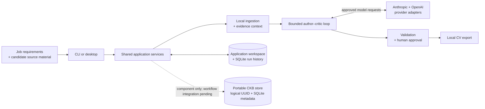

# DraftLoop

[](https://github.com/akoita/draft-loop/actions/workflows/ci.yml)


DraftLoop is a local-first, agentic CV-crafting workspace. It combines a job
description and candidate-provided source material with a source-grounded
evaluator–optimizer loop: an author drafts, an independent critic evaluates
against an explicit rubric, and bounded revisions continue until the candidate
reviews and approves the result.

The agents are useful participants, not authorities: candidate sources stay
traceable, provider exposure is explicit, and export requires human approval.

Traceability does not mean that DraftLoop independently verifies a career. CVs,
profiles, and private-project descriptions are valid candidate sources. The app
guards against model-added facts and contradictions; it does not contact past
employers or replace reference checks, interviews, or technical evaluation.

## What exists today

The repository currently provides the product foundation for the author–critic
workflow:

- canonical workspace, requirements, evidence, rubric, and model configuration
  contracts;
- Zod schemas for persisted and exchanged context;
- Anthropic, OpenAI, and loopback-only local adapters with strict
  structured-output requests;
- independent-review checks by model lineage, data-exposure policy
  enforcement, normalized provider errors, usage/cost metadata, and
  deterministic tests;
- local privacy guardrails, credential redaction, content-free operational
  events, a repository-grounded threat model, and a first/revised/manual
  evaluation comparison gate;
- a phase-0 CLI workflow that connects local ingestion, SQLite history,
  orchestration lifecycle, approval decisions, and local Markdown/DOCX/PDF
  export;
- a desktop review workspace with a typed, capability-limited host bridge and
  deterministic browser fallback;
- a packaged Electron desktop host that connects the bridge to the shared local
  application driver, native workspace/file dialogs, SQLite history, and
  restart-safe review state;
- a portable Candidate Knowledge Base (CKB) store component with a logical UUID
  and lifecycle metadata in a separate local SQLite file at a user-selected
  path;
- bounded, approval-gated URL ingestion for GitHub, certification, profile,
  portfolio, and job-description sources with provenance and typed facts;
- explicit separation of blocking findings, warnings, artifact approval, and
  local export, including persisted override rationales;
- workspace-scoped SQLite FTS/BM25 retrieval, local vector and hybrid benchmark
  implementations, provider retries, and content-free progress events;
- component-level backup/restore, retention purge, diagnostic export, ATS and
  accessibility checks, multilingual templates, additional artifact schemas,
  portfolio ingestion, and an OpenAI-compatible local endpoint adapter.

These capabilities are not all validated product outcomes. The current stage is
the application-grade CV workflow. The portable CKB store currently contains
identity and lifecycle metadata only: source content and versions, workspace
selection, retrieval cutover, CLI and desktop controls, deletion, export, and
restore are not integrated. Application workspaces and their run-history
databases remain separate from the selected CKB store.

## Stack

| Area                     | Technologies                                                        |
| ------------------------ | ------------------------------------------------------------------- |
| Language and runtime     | TypeScript, Node.js 24.5.0, pnpm 10.18.3                            |
| Workspace                | pnpm monorepo with framework-free domain packages                   |
| Model providers          | Anthropic SDK, OpenAI SDK, cross-provider author–critic pairing     |
| Contracts and validation | Zod, strict TypeScript, JSON Schema structured outputs              |
| CLI and desktop shell    | Commander, React 19, Vite, Electron 43, Electron Forge 7            |
| Persistence and output   | Drizzle ORM, SQLite boundary, Markdown/PDF/DOCX rendering contracts |
| Quality                  | Biome, ESLint, Markdownlint, Vitest, GitHub Actions                 |

## Architecture



At a high level, DraftLoop keeps source material and run history local, sends
only approved context through provider adapters, and requires human approval
before local export. The portable CKB store is a separate, user-selected local
SQLite store; its filesystem path is not part of its logical identity and is
not provider data. See the [detailed architecture](docs/architecture.md) and
[ADR 0007](docs/adr/0007-portable-candidate-knowledge-store.md) for the current
component boundary and its unimplemented workflow integrations.

The monorepo separates product contracts from adapters:

- `domain` defines framework-free concepts and workflow states.
- `schemas` validates exchanged and persisted structures.
- `orchestrator` coordinates rounds without knowing provider SDK details.
- `providers` contains the Anthropic, OpenAI, and local adapter boundaries and
  the data-exposure policy they enforce. Independent review is decided in
  `domain` by model lineage, not by provider company.
- `ingestion` and `evidence` normalize local sources and connect claims to
  evidence.
- `validation`, `evaluations`, and `artifacts` check and represent drafts.
- `security` owns privacy classifications, retention defaults, redaction, and
  allowlisted operational events.
- `rendering` and `storage` handle output and local persistence boundaries.
- `application` defines the adapter-neutral use-case contract and safe command
  boundary shared by user-facing adapters.
- `apps/cli` is the first user-facing adapter.
- `apps/desktop` is the React desktop UI shell.

The evaluator–optimizer decision and its trade-offs are recorded in
[ADR 0003](docs/adr/0003-evidence-grounded-evaluator-optimizer.md).

See [docs/releasing.md](docs/releasing.md) for the stage-based release policy,
dry-run workflow, artifact manifest, and maintainer approval boundary.

Product direction, stage outcomes, and exit criteria are maintained in the
[living product roadmap](docs/roadmap.md).

Security and data handling are documented in [the threat model](docs/threat-model.md)
and [privacy and evaluation policy](docs/privacy-and-evaluation.md).

## Quick start

Requirements: Node 24.5.0 and pnpm 10.18.3.

```sh
pnpm install --frozen-lockfile
pnpm validate
```

To run the current CLI shell:

```sh
pnpm start
```

To run or package the native desktop shell:

```sh
pnpm --filter @draft-loop/desktop start
pnpm --filter @draft-loop/desktop package
```

The packaged host is offline-first. Creating a real workspace starts empty and
waits for a target job description and candidate source material. A separately
labeled demo workspace starts the deterministic fixture workflow. The packaged desktop
can collect Anthropic and OpenAI API keys through its typed native bridge and
store them through the host credential store. Live execution remains opt-in and
provider requests are denied unless the data-exposure policy allows them. The
desktop preflight and credential-storage behavior still require cross-platform
acceptance before the workflow is considered validated.

The phase-0 CLI workflow is available with a local workspace manifest:

```sh
pnpm --filter @draft-loop/cli start -- init ./workspace \
  --job-description ./job.md --sources ./evidence --fixture
pnpm --filter @draft-loop/cli start -- start ./workspace
pnpm --filter @draft-loop/cli start -- status ./workspace
pnpm --filter @draft-loop/cli start -- approve ./workspace
pnpm --filter @draft-loop/cli start -- export ./workspace
pnpm --filter @draft-loop/cli start -- export ./workspace --format pdf
pnpm --filter @draft-loop/cli start -- export ./workspace --format docx

# Run the offline phase-0 pilot and write pilot-report.md
pnpm --filter @draft-loop/cli start -- pilot ./pilot-workspace
```

Fixture mode is deterministic and offline. Live provider execution requires
both provider credentials and the explicit `--allow-provider-data` approval;
the CLI prints the provider pairing and budget before starting. Progress output
contains states, steps, counts, and codes, not prompts or source content.

Keep candidate data out of the repository. Before using real application
material, review the provider transmission and retention policy for the
workspace.

Approved artifacts are rendered locally. Every export records the artifact
version, template version, timestamp, format, and SHA-256 checksum in local
history.

The `pilot` command creates synthetic local inputs, runs one critic finding and
one bounded revision, approves and exports the result, and writes a report
containing counts and the next decision. It does not use provider credentials
or include source text, prompts, or provider responses in the report.

## Validation

```sh
pnpm format:check
pnpm lint
pnpm typecheck
pnpm test
```

For development, `pnpm format` applies the Biome formatter. See
[CONTRIBUTING.md](CONTRIBUTING.md) for change and pull request guidance.

## Project status

DraftLoop is an early-stage private project in integration hardening and outcome
validation. The initial use case is a job-specific CV, but the contracts are
intentionally shaped for other evidence-backed drafting and review workflows.
Implemented components beyond the core CV path should not be treated as
validated or production-ready until the roadmap exit criteria are met.

Human approval remains mandatory. DraftLoop does not submit applications,
publish documents, or perform uncontrolled web research on a user's behalf.
