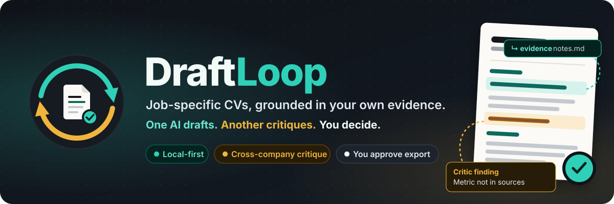
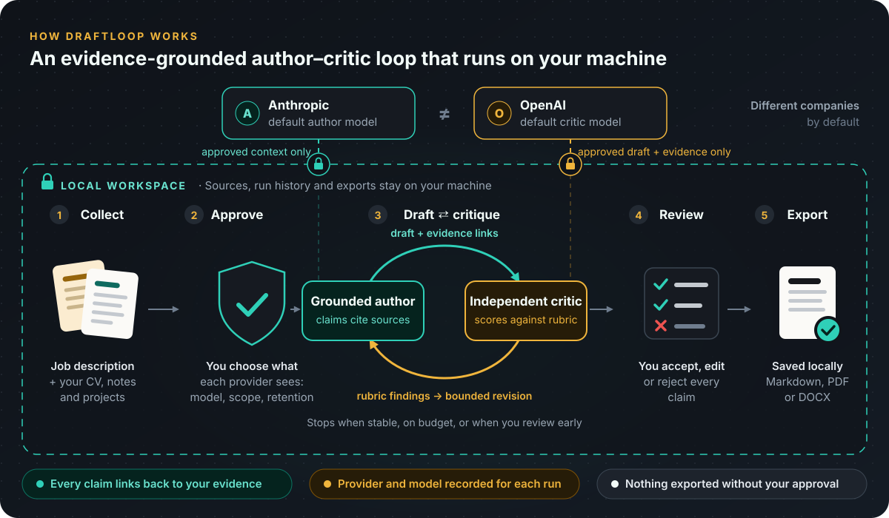
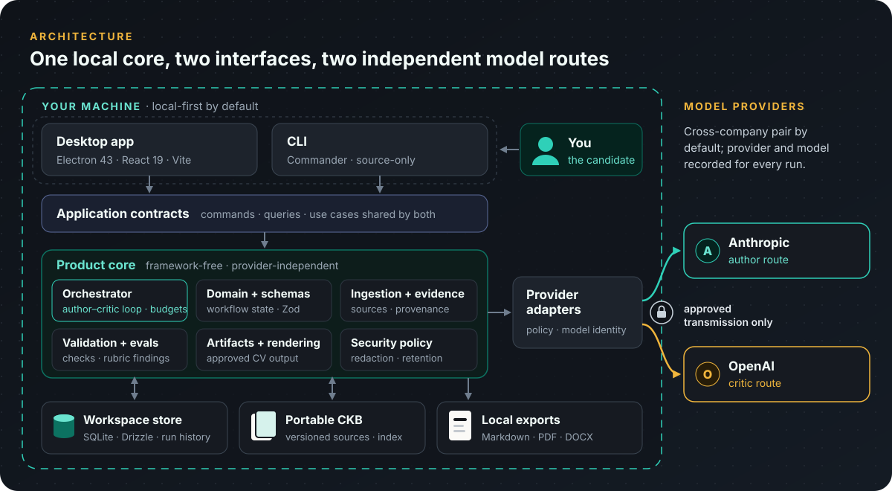

<h1></h1>

[](https://github.com/akoita/draft-loop/actions/workflows/ci.yml)


DraftLoop turns candidate-owned sources into a job-specific CV with local-first
grounding, independent AI critique, and final human control.

It is designed for candidates who want useful drafting assistance without giving
up traceability or control of their source material. Claims remain connected to
candidate-provided evidence, provider and model identities are visible, and the
candidate decides what to approve and export.

> **Current maturity:** DraftLoop is an alpha-stage local-first CV tool. Its
> bounded capabilities are integrated and deterministically validated, but
> the latest fictional two-profile reference observation did not meet its
> coverage exit. No representative consented outcome has been recorded. The
> [roadmap and current status](docs/roadmap.md) record the evidence and
> remaining gaps. This project is not production-ready.

## How DraftLoop works

The workflow keeps the job description and candidate sources in a local
workspace, then applies an evidence-grounded
[evaluator–optimizer workflow](https://github.com/anthropics/claude-cookbooks/blob/main/patterns/agents/evaluator_optimizer.ipynb):
an author generates, an independent critic evaluates against a rubric, and
accepted feedback drives bounded revision. The default cross-company pairing is
Anthropic as author and OpenAI as critic. [ADR 0003](docs/adr/0003-evidence-grounded-evaluator-optimizer.md)
records DraftLoop's adaptation and controls.



The loop is an assistant, not an authority. DraftLoop does not independently
verify a career, contact past employers, replace interviews, or turn a
candidate's source material into permission to invent facts.

## Try the alpha desktop build

Download the [newest release compatible with your platform](https://github.com/akoita/draft-loop/releases)
and its `SHA256SUMS` file. Desktop packages are distributed as platform-specific
ZIP archives, including Windows x64. The releases page is authoritative for the
current platform set and release limitations.

To verify one download, replace `<downloaded-archive>.zip` below with the ZIP
you selected and compare that single digest with its matching line in
`SHA256SUMS`:

```sh
# Linux
sha256sum "./<downloaded-archive>.zip"

# macOS
shasum -a 256 "./<downloaded-archive>.zip"
```

On Windows, run `(Get-FileHash .\your-download.zip -Algorithm SHA256).Hash` in
PowerShell and compare that output with the matching `SHA256SUMS` entry. Extract
the matching ZIP and launch the desktop executable from the extracted folder.
These are v0.8 alpha packages, not signed installers or
dependable real-application tooling; no representative consented outcome has
been recorded, and signing and automatic updates remain ahead. The CLI is a
separate, source-only interface and has no standalone installer.

## Developer quick start

Use Node.js **24.5.0** and pnpm **10.18.3**:

```sh
pnpm install --frozen-lockfile
```

Start the desktop shell and choose **Try demo workspace** to exercise the
deterministic fixture workflow:

```sh
pnpm --filter @draft-loop/desktop start
```

Fixture mode is offline and uses no provider spend. To inspect the source-only
CLI:

```sh
pnpm --filter @draft-loop/cli start --help
```

Every command group — opportunity briefs, candidate profiles, writing
policies, and candidate knowledge bases — is documented with runnable examples
in the [CLI and desktop operations reference](docs/reference/cli-and-desktop.md).

Live use requires an explicit provider-transmission approval in the workspace,
configured provider credentials, and may incur provider cost. Keep real
candidate material out of the repository.

For the normal quality gate, run:

```sh
pnpm format:check
pnpm lint
pnpm typecheck
pnpm test
pnpm validate
```

## Technology and architecture

| Area                  | Technology or boundary                                           |
| --------------------- | ---------------------------------------------------------------- |
| Runtime               | TypeScript, Node.js 24.5.0, pnpm 10.18.3                         |
| User interfaces       | React 19, Vite, Electron 43; source-only Commander CLI           |
| Product core          | Framework-free domain contracts, Zod schemas, orchestrator ports |
| Providers             | Explicit Anthropic and OpenAI SDK adapters                       |
| Local data and output | SQLite via Drizzle ORM; Markdown, PDF, and DOCX exports          |
| Quality               | Biome, ESLint, Markdownlint, Vitest, GitHub Actions              |



The portable Candidate Knowledge Base (CKB) component can store approved local
source versions. CLI and desktop adapters can create, open, list, and inspect
stores; workspaces can also bind explicit store/base snapshots with drift
checks. The integrated path synchronizes and queries exact selected source
versions through each CKB's local lexical index, while legacy workspaces
without a CKB selection continue to use the workspace evidence path.

In a collecting or stopped desktop workspace, **Candidate knowledge** can
create or open a local store. Choose **Use this knowledge base** to replace
the workspace selection with one active base. This clears the selected
canonical profile so you can review a profile against the new selection.
Use **Add file** or **Add directory** beside an active base to import local
material through a native picker. The result reports complete or partial intake
and source readiness; importing does not select that base for the workspace.

**Import workspace candidate sources** imports all supported files from this
workspace’s configured candidate-source directory into the chosen base. This
requires an explicit action before a run or after it stops. Previously imported
directories are rejected.

If the desktop host restarts while a review is open, a workspace operation can
lose its connection. DraftLoop clears that stale review and offers **Open
workspace**. Select the same local directory to recover its saved history before
approving or exporting.

## Trust boundary

- Source material, run history, and exports are local by default.
- A provider receives only context covered by an explicit user approval; the
  workspace shows the provider, model, transmission scope, and retention choice.
- Independent review is a product constraint: the default author and critic use
  different provider companies, and their identities are recorded.
- Model profiles offer economy (Claude Sonnet 5.5 with GPT-6 Luna) and standard
  (Claude Opus 5.5 with GPT-6.1 Sol) pair choices. These exact profiles are
  unvalidated. Existing workspace settings change only when a user explicitly
  applies a different pair, and saved run records remain unchanged. The labels
  do not establish provider availability or CV quality. See the
  [roadmap](docs/roadmap.md#model-strategy).
- The opt-in `development-glm` preset adds the Z.ai
  `zai-org/GLM-5.3-Flash` author through DeepInfra and keeps the GPT-6 Luna
  critic. It requires the dedicated `DEEPINFRA_API_KEY`; pricing metadata uses
  standard $0.15/$0.50 per million input/output rates reviewed on 2026-10-02.
  CV quality is unvalidated and account availability is unchecked. This choice
  does not change defaults or existing workspaces.
- DraftLoop prepares local artifacts. It does not submit applications, publish
  documents, send messages, or perform uncontrolled web research on a user's
  behalf.

## Documentation

- [Documentation map](docs/README.md) · [Roadmap and current status](docs/roadmap.md) · [Release history](https://github.com/akoita/draft-loop/releases)
- [Architecture overview](docs/architecture/overview.md) · [Candidate evidence](docs/architecture/candidate-evidence.md) · [Drafting and review](docs/architecture/drafting-and-review.md)
- [Runtime and trust](docs/architecture/runtime-and-trust.md) · [Architecture decision records](docs/adr/) · [CLI and desktop operations reference](docs/reference/cli-and-desktop.md)
- [Privacy and evaluation](docs/security/privacy-and-evaluation.md) · [Threat model](docs/security/threat-model.md)
- [Contributing](CONTRIBUTING.md) · [Releasing](docs/operations/releasing.md)

Human approval is mandatory before an artifact is exported. DraftLoop can help
prepare a CV, but the candidate remains responsible for factual review, final
approval, and every action outside the local workspace.
