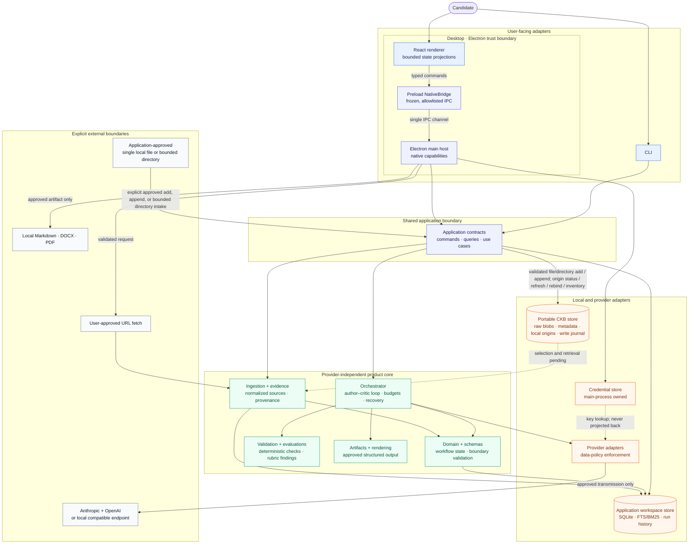

# Architecture

DraftLoop is a local-first multi-model drafting and review workspace. The first
artifact is a job-specific CV, but the contracts are shaped around a reusable
workflow: canonical requirements and evidence produce an artifact, an
independent critic evaluates it, and a human approves the result.

## Boundaries



Solid arrows show application data or control flow. The dotted credential edge
is lookup-only: stored keys are never projected back into the renderer. External
network and export edges require the visible approvals described below. The
solid CKB edge covers explicit managed-file add, bounded recursive directory
intake and add-members operation, read-only bounded directory refresh and
directory-root-rebind eligibility previews, and
observation recording, applied existing-member directory refresh, approved URL
intake and refresh, manual file-version append, and the local
structural-inventory query. Each file write approval covers one local regular
file; a directory approval preflights one bounded real directory and still
creates independent file sources before atomically recording its local binding
and immutable membership; each URL approval covers one bounded validated
HTTPS fetch. Extraction succeeds before persistence, and the application copies
verified exact bytes into the portable store. Inventory is an explicit bounded,
count-only read after normal referenced-blob validation. The dotted CKB edge
marks the still-unintegrated workflow: application selection, retrieval, and
provider use have not crossed that boundary yet.

The renderer receives bounded projections for workspace and run state. Native
dialogs, workspace paths, SQLite handles, credential persistence, provider SDK
construction, URL fetching, and export writes remain in the main process. The
renderer can submit an API key only through the allowlisted credential command;
the main process validates the command and owns encryption, status, removal,
and environment fallback. Browser mode intentionally has no native filesystem
or persistent credential capabilities and keeps a deterministic fixture
fallback. See [ADR 0004](adr/0004-desktop-credential-boundary.md).

- Domain concepts do not depend on provider SDKs, storage engines, or UI
  frameworks.
- Schemas validate data crossing package and persistence boundaries.
- Ingestion turns user-selected local sources into normalized material.
- URL ingestion is a bounded network capability: the user approves the fetch,
  the host validates the URL and response limits, and the resulting source
  retains its original/final URL and provenance.
- Evidence preserves source identifiers and locations for substantive claims.
- Retrieval is workspace-scoped behind a provider-independent port. SQLite
  FTS/BM25 is the integrated lexical baseline and supplies selected chunks to
  live author and critic requests; local vector and hybrid implementations are
  evaluation components until deletion, retention, isolation, and quality are
  validated for the product path.
- The portable Candidate Knowledge Base store is a second local SQLite boundary,
  separate from every application workspace and its run history. Its persisted
  logical UUID identifies the store when its user-selected filesystem location
  changes. The current component stores CKB metadata, stable CKB-scoped source
  identity with file/URL kind and a sensitive local label, ordered immutable
  versions with SHA-256, media type, byte size, and timestamp, and managed raw
  bytes for explicitly approved files. Initial intake and every manual version
  append accept only a regular file of at most 20 MiB in the five
  ingestion-supported media types and persist nothing unless extraction
  succeeds. Each operation also repeats the stable-file and managed-copy checks.
  Changed bytes append ordered parent-linked version N+1; bytes identical to the
  current version return a no-op without advancing version time or creating a
  freshness claim. Raw bytes use an opaque, ID-derived local name with
  restrictive best-effort permissions. A successful managed create remembers
  the canonical physical path from its verified capture in sensitive local-only
  SQLite state; manual append paths never replace it. This binding is copied
  with the database but is not portable continuity, can become stale when the
  store or origin moves/disappears, and is never provider-facing. An explicit
  read-only application check can classify one source as unbound, current,
  changed, missing, or inaccessible. It returns no path, checksum, content,
  media type, size, or label and persists no observation; current means only
  that the checked bytes matched the latest stored version at that moment. A
  separate explicit refresh follows the remembered path, repeats the same
  no-follow ingestion and stable managed-copy gates, and appends changed bytes
  as the next immutable version. Other origin states create no version; refresh
  never changes the binding. Each explicit refresh persists a path-free
  observation against the exact source version examined, with optional last
  successful changed-byte refresh identity/time. A later version advance makes
  that observation deterministically stale; this is not a background watcher or
  time-based freshness claim. A separate explicit rebind
  repeats ingestion and stable capture and replaces only the sensitive local
  path when the selected file exactly matches the latest managed version. It
  publishes no source version or blob, records no managed-write journal event,
  and retains no superseded path history.
  A separate read-only application projection derives exact-integrity duplicate
  groups from each source's latest version within one CKB. It returns only
  deterministically ordered source/version IDs, persists nothing, and never
  merges or removes evidence.
  An explicit application operation can also record an immutable logical
  retirement marker for one source. Retired sources reject version, rebind, and
  refresh-observation writes while their source/version metadata, managed bytes,
  binding, and last observation remain intact for audit and later retention
  policy. Lifecycle remains separate from refresh freshness: selection and
  retrieval must reject a retired source explicitly, and retirement neither
  deletes indexes nor authorizes physical cleanup. Reactivation is not yet
  defined.
  Initial approved CKB URL intake reuses the bounded HTTPS ingestion boundary
  and publishes the exact fetched response bytes under the same opaque layout.
  Immutable per-version local provenance retains the approved original URL,
  validated final redirect URL, fetch time, and bounded URL kind. Those fields
  are excluded from generic manifests, journals, inventory, diagnostics,
  errors, and provider requests. Explicit URL refresh requires a new approval,
  re-fetches only the stored original URL, and rejects invalid scope, kind, or
  retirement before network access. Changed exact bytes append a parent-linked
  version with new immutable redirect provenance; identical bytes, including a
  redirect-only change, are a no-op. A valid approved fetch/extraction failure
  records only a URL-free `inaccessible` observation. Redirect history,
  conditional requests, background refresh, and time-based readiness remain
  unimplemented.
  Exact paths remain absent from the portable
  descriptor, source/version metadata, manifests, journal rows, inventory,
  diagnostics, and application projections. A complete directory import keeps
  its canonical root and each file's existing origin binding only in sensitive
  local SQLite state; membership stores SHA-256 hashes of normalized relative
  paths, never plaintext paths. Source identity and its sensitive label stay
  stable even if a
  later selected path or basename differs. It does not drive retrieval or
  appear in CLI or desktop workflows. See
  [ADR 0007](adr/0007-portable-candidate-knowledge-store.md).
- A bounded recursive directory-intake helper is a bounded selector over
  ordinary managed file sources. It requires a real non-symlink
  root outside the CKB store, checks canonical containment, traverses in lexical
  relative-path order, and preflights all extraction before any managed write.
  Depth, scanned entries, accepted files, aggregate bytes, and the existing
  20 MiB per-file limit are bounded. Dot-prefixed entries/subtrees, unsupported
  files, special entries, and child symlinks are skipped and counted. The
  component creates no directory source kind. A complete import records one
  opaque directory binding and immutable hashed membership in sensitive local
  SQLite state; partial and legacy runtime-only imports have no membership.
  An explicit add-members operation can append unmatched accepted files from an
  existing binding as new managed file sources and immutable members in lexical
  path order, committing each candidate atomically and returning path-free
  partial IDs after a later failure. That membership is a stable historical
  mapping captured at binding or explicit append time:
  later source version appends, explicit origin rebinding, or source retirement
  do not rewrite it. Incremental directory scan reconciliation, rename,
  complete removal reconciliation, and broader member-retirement policy remain
  unimplemented.
  A local explicit bounded refresh preview can classify historical members as
  `current`, `changed`, `missing`, `retired`, or `origin-conflict` and count
  unmatched accepted files. It exposes no paths or integrity metadata and makes
  no source, version, membership, observation, or lifecycle writes.
  A separate read-only directory-root-rebind eligibility preview rescans one
  candidate real non-symlink root, requires exact normalized-relative-path
  membership and latest-byte agreement for every historical member, and
  returns only path-free readiness and scan counts. An explicit application
  operation reuses that single scan, performs stable per-member final
  verification, and atomically commits all origin updates plus the next root
  revision; same-root requests are guarded no-ops and failures are generic with
  no partial result.
  Storage now also provides the v14 append-only root-revision foundation: v13
  bindings backfill as revision 1, fresh bindings receive revision 1, and a
  current-root view drives path-sensitive reads. A verified storage/handle
  transaction can validate every member and atomically update current origin
  bindings plus the next revision, or return a guarded same-root no-op. The
  immutable v13 binding/member rows remain historical evidence; rename/removal
  reconciliation and broader lifecycle policy remain deferred.
  Storage v15 adds append-only per-member revision rows and a current-member
  view. Existing v13 members backfill as revision 1 at the later of immutable
  binding time or source creation; future members receive the same baseline
  trigger. Historical hashes remain owned by their original source, while that
  source may return to one of its own earlier hashes. A verified storage/handle
  move can atomically update one sensitive origin and append one member revision
  or return a guarded no-op without changing source, version, observation,
  retirement, blob, or journal evidence. The application move command remains
  deferred with #135/#136, automatic inference, physical deletion, adapters,
  indexing, and background refresh.
  A separate moved-candidate projection reuses that complete scan exactly once
  and emits only deterministic source IDs for unique one-to-one exact
  media-type/checksum/size matches between same-member missing sources and
  unmatched files. Ambiguous tuples emit nothing; the unchanged aggregate
  `newSourceCount` still counts every unmatched accepted file. The signal is
  advisory only and does not apply renames or revise membership.
  A separate explicit bounded observation operation reuses exactly one complete
  scan, selects only active `current`, `changed`, or same-member `missing`
  entries, and atomically records their path-free observations with one shared
  timestamp. Retired, origin-conflict, and new files remain report-only; the
  operation allocates no IDs and writes no bytes, versions, membership, origin
  bindings, retirements, or journal events. Rename/removal decisions, automatic
  retirement or deletion, adapters, indexing, and background refresh remain
  deferred.
- An explicit bounded directory-root rebind reuses one complete scan, performs
  stable per-member final verification, and commits all sensitive origin updates
  plus the next append-only root revision atomically. A current-root request is
  a guarded no-op; failures are generic and do not return partial results.
- An explicit bounded applied directory refresh reuses that same complete scan.
  It processes active same-member files in source-ID order, appends only changed
  bytes through the stable managed-file path with current-version/origin-revision
  guards, and records current observations for successful changed, current, and
  same-member-missing entries. Retired, origin-conflict, and new files remain
  report-only. A later member failure returns a path-free partial result after
  earlier member commits; rename/removal decisions, member-retirement
  lifecycle, automatic retirement/deletion, adapters, indexing, and background
  refresh remain deferred.
- An explicit bounded add-members operation reuses one complete scan of an
  existing binding, allocates IDs only for unmatched accepted files, and creates
  each file source, initial version, sensitive origin binding, managed blob,
  journal event, and immutable membership atomically per candidate. Existing
  member states are report-only, new members receive no refresh observation, and
  complete removal reconciliation, renames, automatic retirement/deletion, and
  writer coordination remain deferred.
- An explicit approved directory-member retirement operation reuses one complete
  bounded scan and accepts only an active same-member `missing` member. It
  atomically records the existing `user-requested` retirement marker with
  latest-version, origin-revision, and chronology guards. `removed` means
  logical retirement only: bytes, versions, origin bindings, observations,
  journal state, and immutable membership remain; an already retired member
  returns `already-removed` without a write. Complete directory reconciliation,
  physical cleanup, and broader lifecycle policy remain deferred.
- Managed source add and append publish verified bytes without replacement before
  committing their version-6 database marker. Committed markers always require
  matching opaque bytes; file sources retain their additional regular-file and
  origin-binding checks. Ordinary failures clean up; crashes or
  concurrency can leave unreferenced opaque files. Their shape does not prove
  DraftLoop ownership.
- SQLite migration v7 adds an internal append-only ownership journal for new
  managed creates and appends. Each operation records opaque intent before
  staging, resolved-target selection before publication, publication and atomic
  managed-marker/database-commit events, and completion only after staging cleanup. New staging names are
  opaque operation-derived hashes. The journal excludes origin paths,
  filenames, labels, checksums, source content, provider data, diagnostic
  projections, cleanup tokens, and approvals; its identifiers do not cross the
  application boundary.
- The application can explicitly request a bounded structural inventory after
  referenced managed blobs pass their normal validation. The result exposes
  only counts for verified managed files, scanned entries, staging-shaped and
  other opaque root entries, extra entries under expected managed-source
  directories, symlinks, special/other entries, and complete/scan-limit status.
  It exposes no names, paths, IDs, labels, checksums, or content; follows no
  unknown symlinks; does not recurse into unknown directories or read unknown
  file bytes; and performs no mutation. Structural categories do not authorize
  adoption, quarantine, repair, or deletion. The prospective journal supplies
  evidence for new writes only; a future cleanup design still needs writer
  coordination and explicit approval, and unjournaled entries remain unknown.
- Version-7 journal provenance is prospective. It does not claim legacy
  version-6 writes or other pre-existing entries, trigger an automatic scan, or
  authorize deletion, adoption, quarantine, repair, or reconciliation.
  Same-current-byte managed appends record a terminal, non-owning no-op.
  Metadata-only versions can
  be explicitly materialized under normal managed-copy checks without adopting
  a pre-existing unowned target based on matching bytes or shape. Future
  cleanup still needs writer locks or leases plus explicit visible approval.
- Managed blobs and SQLite metadata are plaintext. A source whose label resembles
  `AGENTS.md` or other configuration remains inert candidate data and never
  changes application instructions, policy, or permissions.
- The orchestrator owns round sequencing, budgets, pause/stop behavior, and
  user-visible run events; provider adapters own SDK translation only.
- The application package owns adapter-neutral use cases and command/query
  contracts. CLI and desktop adapters use the same local driver without
  importing one another or exposing provider SDKs to the UI.
- Validation is deterministic where possible. Evaluations represent rubric
  scores and structured critique; neither is treated as proof of truth.
- Storage is local by default. Rendering consumes approved artifacts and does
  not submit them anywhere.
- Backup/restore, retention purge, and content-free diagnostic export are
  explicit operations for application workspaces. They do not yet export,
  restore, or delete the separate CKB store, and a SQLite-only copy is not a
  complete CKB backup because it omits managed raw bytes. Their existence does
  not imply encrypted storage or validated disaster recovery on every platform.
- Context snapshots cross the persistence boundary through
  `serializeContextSnapshot` and `parseContextSnapshot`; the Zod schema checks
  version, requirements, evidence checksums, rubric values, and model identity
  before a snapshot is reloaded.

## Evidence-grounded evaluator–optimizer

DraftLoop applies the evaluator–optimizer pattern to a factual, evidence-backed
workflow. The author is the optimizer's generator, the independent critic is
the evaluator, and each revision is a bounded optimization step against a
visible rubric. The product uses the author–critic language in the UI because
it is easier for candidates to understand; the evaluator–optimizer description
names the underlying control pattern.

```text
canonical inputs + rubric
          |
          v
     author draft ---------> structured artifact + evidence links
          ^                                      |
          |                                      v
   bounded revision <----- independent evaluator + deterministic checks
          |
          v
  stable / budget exhausted / user review early
          |
          v
       human approval -> local export
```

The loop is deliberately not a generic “make the prose better” cycle:

- The rubric covers factuality, evidence support, requirement coverage, and
  quality. Deterministic validators handle checks that do not need a model.
- Evaluator findings are structured, actionable, severity-rated, and linked to
  claims, sections, or source locators where applicable.
- The evaluator may identify a problem, but it cannot establish truth by
  itself. User evidence and explicit human decisions remain authoritative.
- A different provider is used by default for author and evaluator, with both
  provider and model identities recorded in run history.
- The orchestrator stops after configured round, cost, or time limits, when
  quality is stable, or when the user chooses to review early. It never loops
  indefinitely to optimize a subjective score.

This makes the pattern especially suitable for CV drafting: the output is
verifiable against a target job and candidate-owned sources, while unsupported
claims remain visible instead of being polished into false confidence.

See [ADR 0003](adr/0003-evidence-grounded-evaluator-optimizer.md) for the
decision and trade-offs.

## Author–critic loop

1. Create a workspace with a job description, local evidence directory,
   instructions, truthfulness policy, and readiness rubric.
2. Ingest and normalize selected source files into a canonical evidence base.
3. Ask the author to create a draft and attach evidence references to important
   claims.
4. Give the independent critic the same canonical inputs, the draft, and the
   rubric. The critic returns structured findings with categories and severity,
   not an untracked rewrite.
5. Ask the author to revise each finding or record a user-visible reason for
   rejecting it.
6. Repeat within the configured round and cost/time budgets.
7. Run deterministic checks, surface unresolved disagreements, and require
   explicit user approval before export.

The default provider pairing is cross-company: one Anthropic model and one
OpenAI model, with roles configurable and swappable. Provider identity and
model version are part of the run history. Same-company pairings may be
available as an explicit choice but must be visible and warned about.

## Workflow state machine

The state machine describes the lifecycle of a workspace run. A transition must
emit an auditable event and retain the relevant inputs, outputs, evidence links,
and user decision.

| State               | Meaning                                                                                                               | Allowed next states                                                                                                                                          |
| ------------------- | --------------------------------------------------------------------------------------------------------------------- | ------------------------------------------------------------------------------------------------------------------------------------------------------------ |
| `collecting`        | Workspace inputs are being assembled.                                                                                 | `ingesting`, `paused`, `stopped`                                                                                                                             |
| `ingesting`         | Selected local material is being normalized.                                                                          | `drafting`, `collecting`, `paused`, `stopped`                                                                                                                |
| `drafting`          | The configured author is creating a draft.                                                                            | `reviewing`, `paused`, `stopped`, `budget-exhausted`                                                                                                         |
| `reviewing`         | The independent critic is producing structured findings.                                                              | `revising`, `awaiting-approval`, `paused`, `stopped`, `budget-exhausted`                                                                                     |
| `revising`          | The author is addressing accepted findings.                                                                           | `reviewing`, `awaiting-approval`, `paused`, `stopped`, `budget-exhausted`                                                                                    |
| `provider-error`    | A provider request failed and safe provider, model, step, request-id, and attempt metadata is available for recovery. | The corresponding active step on explicit retry (at most three orchestration attempts), `awaiting-approval` when an artifact can return to review, `stopped` |
| `awaiting-approval` | Checks are complete and the user must decide.                                                                         | `approved`, `revising`, `paused`, `stopped`                                                                                                                  |
| `approved`          | The user approved the current artifact.                                                                               | `exported`, `revising`                                                                                                                                       |
| `exported`          | An approved artifact was rendered locally.                                                                            | —                                                                                                                                                            |
| `paused`            | The user temporarily suspended the run.                                                                               | `collecting`, `drafting`, `reviewing`, `revising`, `awaiting-approval`, `stopped`                                                                            |
| `stopped`           | The user ended the run.                                                                                               | —                                                                                                                                                            |
| `budget-exhausted`  | A round, cost, or time budget ended the loop.                                                                         | `awaiting-approval`, `revising`, `stopped`                                                                                                                   |

The loop should enter `awaiting-approval` when the readiness criteria are met,
quality is stable across configured consecutive rounds, or the user chooses to
review early. It must also enter that state after a budget is exhausted so the
user can inspect the best available artifact. It must not claim readiness when
high-severity factuality issues remain, critical job requirements are
unaddressed without an explicit gap, or a new unsupported claim was introduced.
`provider-error` remains distinct through the application and desktop boundaries.
The user may retry only a retryable failure below the orchestration limit, return
an existing artifact to review without deleting failure history, or stop. Each
provider-transmitting action must pass the current policy acknowledgement; a
retry does not silently broaden the acknowledged transmission scope.

## Trust and privacy controls

The system keeps evidence links, structured findings, approved artifact
versions, revisions, decisions, provider/model identity, usage, and checksums
recoverable without storing hidden chain-of-thought. Raw prompts and raw
provider responses are not operational-log or audit payloads; only structured,
user-visible work product required by the workflow is retained under the local
data policy. Provider calls require an explicit data policy, and local retention
settings must be visible per workspace. Human approval is mandatory; job
discovery, application submission, and uncontrolled external research are
outside the MVP.

See [the threat model](threat-model.md) and [privacy and evaluation
policy](privacy-and-evaluation.md) for the current trust boundaries, redaction
rules, retention defaults, and deterministic evaluation gate.

The CLI and packaged desktop host are adapters over these contracts. They use
the same local application driver, which stores a small workspace manifest
beside an application-specific SQLite history file, ingests selected local
sources, constructs a context snapshot, and drives the orchestration engine.
That workspace and run history remain distinct from the portable CKB store.
The application contract can approve and copy one supported local regular file
into the store, manually append approved changed bytes to an existing file
source, explicitly check or refresh one remembered origin without path
projection, explicitly rebind an exact-byte moved origin, approve initial URL
intake or immutable-origin URL refresh, or request its bounded count-only
structural inventory.
Neither user-facing adapter yet provides CKB controls. A successful managed
create now records its canonical verified physical origin in a sensitive,
local-only SQLite binding table; manual appends never change it. The binding is
copied with the SQLite database but is not portable continuity, can become
stale when the store moves machines or the origin moves/disappears, and is never
provider-facing. The explicit status result is point-in-time only and remains
read-only. Explicit refresh appends only changed bound bytes under the normal
immutable managed-copy contract, does not rebind, and records a path-free
last-observation state tied to the exact source version. An
explicit rebind changes only sensitive local origin configuration after an
exact latest-managed-version match and exposes no path or integrity metadata.
New-member persistence is available only through the explicit bounded add-members
operation, and explicit missing-member retirement is available only through the
approved directory-member operation; complete removal reconciliation,
automatic retirement/deletion, background refresh, time-based freshness policy,
automatic moved-origin
discovery, adapter-level refresh/rebind/duplicate controls, incremental
directory reconciliation and membership lifecycle,
URL redirect history and conditional requests, automatic duplicate resolution,
indexing and retrieval,
application/run CKB selection, deletion, repair of missing/corrupt referenced blobs, durable
writer coordination, cleanup approval/reconciliation, and complete
backup/export/restore remain pending; the internal prospective journal is not
a user-facing lifecycle control, and the current retrieval path still reads
workspace-scoped evidence. Offline fixture agents make the lifecycle testable
without network access. The desktop renderer uses the same
adapter-neutral review port through a capability-limited bridge; browser mode
has no filesystem or persistent
credential capabilities and retains only a deterministic fixture fallback.
Live provider execution is opt-in and the provider boundary enforces the request
data policy before the SDK call. Approved artifacts are rendered locally to
Markdown, controlled DOCX, or controlled PDF. Each renderer consumes the same
ordered structured artifact; the application records artifact version, template
version, timestamp, format, MIME type, and checksum in the immutable export
record.

Additional artifact schemas, multilingual templates, portfolio ingestion, and
the local endpoint adapter reuse these boundaries at component level. They are
not considered integrated or outcome-validated merely because their contracts
and tests exist; the [roadmap](roadmap.md) records the evidence level for each
stage.

The `pilot` CLI command uses synthetic local fixtures to validate the phase-0
mechanics end to end: ingestion, authoring, independent criticism, one bounded
revision, approval, export, typed local history, and audit events. Its report
contains only safe counts and identifiers. It is a workflow validation, not
evidence that the quality hypothesis has been proven on real applications.
