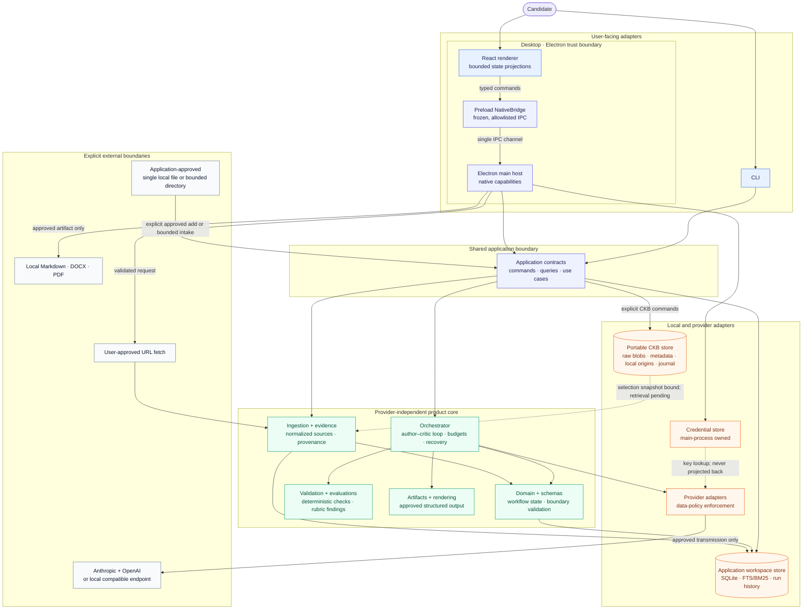

# Architecture

DraftLoop is a local-first, multi-model drafting and review workspace. The
first artifact is a job-specific CV, but the contracts are shaped around a
reusable workflow: canonical requirements and evidence produce an artifact,
an independent critic evaluates it, and a human approves the result.

## Boundaries



Solid arrows show application data or control flow. The dotted credential edge
is lookup-only: stored keys are never projected to the renderer. Network and
export edges require visible approval. The solid CKB edge covers the explicit
file, URL, and bounded-directory commands described below. The dotted edge
marks the path-free selection evidence now bound to new run contexts; CKB
content retrieval remains unintegrated.

The renderer receives bounded projections for workspace and run state. Native
dialogs, workspace paths, SQLite handles, credential persistence, provider SDK
construction, URL fetching, and export writes remain in the main process. The
renderer can submit an API key only through the allowlisted credential command;
the host validates it and owns encryption, status, removal, and environment
fallback. Browser mode has no native filesystem or persistent credential
capabilities and keeps a deterministic fixture fallback. See [ADR
0004](adr/0004-desktop-credential-boundary.md).

## Package and data ownership

| Boundary                                         | Owns                                                                                               | Does not own                                                         |
| ------------------------------------------------ | -------------------------------------------------------------------------------------------------- | -------------------------------------------------------------------- |
| `packages/domain` and `packages/schemas`         | Framework-free concepts, workflow states, and Zod validation at persistence/exchange boundaries    | Provider SDKs, storage engines, or UI frameworks                     |
| `packages/ingestion` and `packages/evidence`     | Approved local/URL intake, extraction, normalized material, provenance, and source references      | Application selection or provider transport                          |
| `packages/orchestrator`                          | Author–critic sequencing, budgets, pause/stop, recovery, and user-visible run events through ports | Provider-specific SDK calls                                          |
| `packages/validation` and `packages/evaluations` | Deterministic checks, rubric findings, and structured critique records                             | Proof of truth independent of candidate evidence and human decisions |
| `packages/artifacts` and `packages/rendering`    | Approved structured output and local Markdown/DOCX/PDF rendering                                   | Submission or publishing                                             |
| `packages/storage`                               | Workspace history and portable CKB persistence, including managed bytes and local-only state       | CKB selection, retrieval policy, or UI                               |
| `packages/providers`                             | Provider identity, SDK translation, policy enforcement, and model calls                            | Domain workflow decisions                                            |
| `packages/application`, CLI, and desktop host    | Adapter-neutral use cases and shared user-facing contracts                                         | A second domain layer or provider SDKs in the UI                     |

Retrieval is workspace-scoped behind a provider-independent port. SQLite
FTS/BM25 is the integrated lexical baseline and supplies selected chunks to live
author and critic requests. Local vector and hybrid implementations remain
evaluation components until deletion, retention, isolation, provenance, and
quality are validated for the product path.

[ADR 0008](adr/0008-ckb-scoped-lexical-retrieval.md) defines the CKB cutover:
each portable store owns its replaceable exact-source-version lexical index,
while the application fans out only across the workspace's explicit selection
and persists content-free retrieval traces in workspace history. This keeps
active derived rows inside the lifecycle boundary that can delete or rebuild
them. SQLite migration 25 supplies the separate CKB chunk/FTS projection,
manifest freshness inspection, deterministic exact-scope query and fallback,
whole-projection invalidation on source-version deletion, and immutable
workspace trace persistence. Runs with an explicit CKB selection now rebuild
the exact selected projection, query it through application fan-out, persist
content-free traces, and provide only opaque chunk references and bounded text
to author and critic. Legacy workspaces without a CKB selection continue to
use the earlier workspace evidence index.

## Opportunity brief contract

The #67 components define a provider-independent, versioned opportunity brief
with durable local persistence and application-level intake. A brief distinguishes job
postings, social announcements, company context, and candidate instructions;
records approved-URL, local-file, pasted-content, or direct-input provenance;
and keeps role, employer, responsibilities, requirements, priorities, and
candidate instructions source-linked. Opportunity requirements are employer
context, never candidate facts.

Draft briefs may retain inaccessible, unsupported, failed, partial, stale,
duplicate, or contradictory source issues. A reviewed brief requires the
minimum structured opportunity fields and no open issue; acknowledged source
limitations remain visible. Candidate-instruction sources may support only the
instruction fields, while opportunity facts may not cite them. The contract
stores bounded structured fields and checksums, not raw source content or host
paths, and preserves human-authored ordering.

The next #67 component connects that contract to application-level source
intake. One draft may include explicitly approved HTTPS URLs, selected local
files, pasted content, and direct candidate instructions. Existing bounded
ingestion controls remain authoritative. Captured sources retain checksums;
failed or inaccessible sources retain a visible status and issue without a
fabricated checksum. The draft contains provenance metadata, not raw intake
content or host paths. Duplicate captured bytes remain visible for review.

Edits and review create immutable successive brief versions. Review still
requires the minimum structured opportunity fields and no open issue; editing
a reviewed brief creates a new draft rather than changing the reviewed value.
SQLite schema v22 persists those versions under a workspace-scoped composite
identity with canonical payload checksums, immediate-parent enforcement, and
immutable update/delete guards. Identical writes are idempotent; latest-version
lookup does not create a mutable current pointer. Audit events retain only an
opaque brief identity, version, status, and checksum rather than brief content
or source provenance.

An adapter-neutral application service reloads validated, deeply frozen
versions after restart and applies edits or review only to an explicitly
expected latest version. Reload never refetches URLs or local files. Provider
extraction uses the configured author model through the existing
Anthropic/OpenAI/local adapter boundary and requires the same explicit data
approval as drafting. Only sanitized opportunity source records cross that
boundary; candidate inputs, URLs, paths, and provenance remain local. Provider
output is schema-checked and citation-checked before application-owned IDs are
created, while failures become fixed content-free draft issues. Shared
application operations now create, reload, list, edit, and review durable
versions. The CLI accepts runtime-only JSON manifests; the desktop host owns
native file selection and returns a bounded path- and URL-free projection
through its strict capability bridge. A new run may select one exact reviewed
brief ID and version. The application verifies its stored checksum, derives the
opportunity context only from that reviewed record, and persists a safe
ID/version/checksum reference in the immutable run context. Resume reuses that
snapshot; it cannot select a different opportunity version. Source URLs, paths,
raw text, and provenance remain outside provider-facing context.

## Writing policy enforcement

Writing policies are local, immutable, checksum-addressed versions. Activating
a Markdown or text file appends it to the workspace's SQLite policy history and
makes it the default for future runs. Importing appends a version without
changing that default. Existing managed files are migrated lazily, and direct
managed-file changes are versioned before the next run rather than silently
overwriting history.

The policy compiler recognizes bounded forbidden-term and
forbidden-punctuation rules, tone, spelling locale, verbosity, a one- or
two-page target, section order, emphasis areas, and transparent anti-formulaic
defaults. The defaults are ordinary forbidden-term rules and can be disabled
explicitly in the policy. Older content-only policy snapshots remain readable.
Preferences are advisory model context: locale is not a spell checker, page
target is not a rendering profile, and emphasis does not authorize new facts.

`packages/validation` evaluates the deterministic rules in artifact section
and block order. Each finding carries a stable rule identity and content-free
block location; messages do not copy the forbidden term, matched draft text,
source paths, or surrounding content. The orchestrator applies the exact policy
from the immutable context during normal draft validation before independent
critique.

Section-order validation is deterministic and reports stable, content-free
section and block locations. Page targets and emphasis areas remain advisory;
rendering QA separately verifies the produced document.

A reviewed opportunity may select one imported policy version as a complete
run-specific override. The application verifies both immutable versions,
records base and override checksums in the run context, and supplies the
effective policy to both author and critic. The selection never changes the
active workspace policy. CLI and desktop projections expose safe version and
lineage metadata; exact policy content is available only through an explicit
local content-read action.

## Portable Candidate Knowledge Base

### Workspace versus portable CKB

An application workspace contains opportunity context, run snapshots, review
decisions, artifacts, exports, and application-specific SQLite history. A
portable CKB is a separate local SQLite store for reusable candidate material.
The CKB has a logical UUID independent of its selected filesystem path. A
workspace does not implicitly read CKB content. Its local manifest may bind
explicitly named CKBs by runtime store root and pinned logical store/CKB IDs.

Before each new run, the shared application boundary reopens those stores,
checks their logical identities and lifecycle readiness, and embeds a freshly
canonicalized, path-free selection snapshot in the immutable run context.
Existing runs continue to use the snapshot they originally recorded. Before a
provider-capable start, resume, or revision transition, the application reopens
the current local binding and compares its complete canonical entries with that
record. Missing, replaced, unready, or changed evidence fails with a path-free
review-required error before provider execution or run-state mutation.

The portable store is local and plaintext. Restrictive filesystem permissions
are best-effort and are not encryption or protection from another process run
by the same user. A SQLite-only copy is not a complete CKB backup because raw
managed bytes live beneath the store's opaque `sources/` layout.

### Source and version model

A source has a stable CKB-scoped logical ID, a `file` or `url` kind, and a local
label. An immutable ordered version records SHA-256, media type, byte size,
creation time, and parent lineage. Checksums are integrity metadata and a
duplicate signal, not source identity. A read-only duplicate projection emits
only deterministic source/version IDs; it does not merge, prefer, or remove
evidence.

Approved local files are regular files no larger than 20 MiB in the five
supported media types: plain text, Markdown, HTML, PDF, and DOCX. Extraction,
stable-file, and managed-copy checks must succeed before persistence. The store
copies exact bytes under an opaque ID-derived name. A changed append creates
the next parent-linked version; identical current bytes are a no-op and do not
advance time or imply freshness.

Approved URL intake reuses the HTTPS-only boundary, including public-address
resolution, manual redirects, response and extraction limits, and usable-text
checks. It stores exact response bytes and sensitive per-version provenance for
the approved original URL, validated final redirect, fetch time, and bounded
URL kind. URL refresh is explicit, reuses only the stored original URL, and
records changed bytes as a new version. Redirect-only drift is a no-op; failures
after approved preflight record only a URL-free inaccessible observation.

### Origins, refresh, and lifecycle

A successful managed file create may remember its canonical verified origin path
in a sensitive local-only binding table. Manual append paths are runtime-only;
they never replace the binding. An explicit status check returns only
`unbound`, `current`, `changed`, `missing`, or `inaccessible`, without the path
or observed file metadata. Explicit refresh can append changed bytes from the
remembered origin and records a path-free observation tied to the examined
version. Explicit rebind replaces only the sensitive path after an exact
media-type, checksum, and size match with the latest version. None of these
operations runs in the background or exposes an origin to a provider.

Retirement is an immutable logical `user-requested` marker. It blocks later
version, rebind, and refresh-observation writes while preserving source/version
metadata, managed bytes, bindings, observations, and journal evidence. It is
not physical deletion, index cleanup, or reactivation.

Lifecycle readiness is a CKB-scoped read projection over one consistent SQLite
snapshot. Each source exposes its latest version identity, `ready` or `blocked`
state, bounded reasons, and a structured revision containing only safe IDs,
timestamps, booleans, and numeric current-directory revisions. The revision
changes when eligibility-relevant persisted evidence changes. Labels, paths,
URLs, relative-path hashes, content checksums, media types, sizes, and bytes are
excluded. Fresh intake is eligible without a refresh observation; adverse or
stale observations block without creating a TTL or live-filesystem claim.

### Selection snapshot contract

An explicit application selection produces an immutable schema-versioned
snapshot containing the portable store ID, CKB ID, exact selected source and
version IDs, and each source's safe structured lifecycle revision. A single CKB
needs no additional combination approval; selecting more than one requires an
explicit approval before any store is opened. Archived, empty, or blocked CKBs
fail closed.

Entries and sources are canonicalized in lexical order. The snapshot excludes
store roots, display labels, paths, filenames, URLs, hashes, checksums, media
types, byte sizes, and content. It can be embedded in an immutable context
snapshot without breaking older context records that predate the optional
field. The local workspace binding retains runtime roots only so future runs can
revalidate the pinned identities; descriptors, context snapshots, run history,
diagnostics, and provider requests expose only the path-free record. The record
does not authorize provider transmission or establish retrieval-index
freshness.

### Directory and member lifecycle

Directory intake is a bounded selector over ordinary managed file sources, not
a directory source kind. The selected root must be a real non-symlink directory
outside the CKB store. Traversal is deterministic by lexical relative path and
preflights extraction before writes. Limits are depth 32, 1,024 scanned entries,
256 accepted files, 256 MiB aggregate accepted bytes, and the 20 MiB per-file
limit. Dot-prefixed entries/subtrees, unsupported files, special entries, and
child symlinks are skipped and counted. A complete import records a sensitive
root binding and immutable SHA-256 hashes of normalized relative member paths.

The current bounded operations are summarized here; their full contract and
privacy invariants are canonical in [ADR 0007][adr-0007].

| Operation                     | Scope and result                                                                                                                                                                                           | Writes                                                                                                                                |
| ----------------------------- | ---------------------------------------------------------------------------------------------------------------------------------------------------------------------------------------------------------- | ------------------------------------------------------------------------------------------------------------------------------------- |
| Inventory and refresh preview | Count-only store inventory; path-free member states (`current`, `changed`, `missing`, `retired`, `origin-conflict`) and unmatched-file count                                                               | None                                                                                                                                  |
| Add members                   | Confirm and append unmatched accepted files as independent sources in lexical order through shared CLI/desktop controls                                                                                    | Each candidate's source, version, origin binding, managed bytes, journal event, and immutable member atomically                       |
| Observation / applied refresh | Record path-free observations, or append changed bytes for existing active same-member files in source-ID order                                                                                            | Observation batch is atomic; applied refresh may return path-free partial progress after a later member failure                       |
| Member retirement             | Approve one active same-member `missing` member with root/member/version/origin guards                                                                                                                     | Existing immutable `user-requested` retirement marker only; bytes and membership remain                                               |
| Root rebind                   | Reuse one complete scan, verify every historical member, and update all origins                                                                                                                            | Guarded append-only root revision with path-free `rebound` counts, or path-free `current` no-op                                       |
| Moved-candidate preview       | Compare exact media type, checksum, and size for same-member missing sources and unmatched files                                                                                                           | None; ambiguous matches are omitted                                                                                                   |
| One-source member move        | Reuse exactly one bounded scan for one selected source; accept a unique exact-integrity missing-member match or the scanned current member for idempotency                                                 | Verified append-only member revision, or guarded no-op; result is frozen, path-free `moved`/`current`                                 |
| Missing-member reconciliation | Partition one complete scan into path-free current, changed, moved-candidate, missing, already-retired, conflicted, and unmatched/new state; apply only explicitly selected retirements in source-ID order | Each retirement marker is atomic; all-success returns `applied`/`current`, while a later failure returns frozen path-free partial IDs |

The explicit move command accepts no target path. It forwards a runtime-only
match through the verified member handle and does not change source identity,
version, observation, retirement, blob, journal, or baseline membership
evidence. Root rebind and one-source member move are exposed through shared
CLI and desktop adapters; moved-candidate preview is read-only, while move
requires confirmation and returns only opaque identity, time, and status.
Neither infers renames automatically or reconciles all removals.

Automatic move inference, indexing, and background refresh remain deferred
under their owning roadmap issues.
Historical membership is not rewritten by later source versions, explicit
origin rebinds, retirement, or readiness projection.

### Managed publication and journal

Managed publication verifies bytes before committing metadata. The database
marker and opaque file must agree on checksum and size; publication is
no-replace, file first, database second. Crashes or concurrent losers may leave
unreferenced opaque entries, but shape or matching bytes do not authenticate
DraftLoop ownership.

The append-only journal records opaque intent, target resolution, publication,
managed-marker/database commit, and completion for new managed writes. Versioned
ownership, expected integrity, immutable staging-file identity, and
writer-generation fields remain sensitive local state. Recovery first records a
durable claim with its newer generation, which fences stale journal and commit
transactions before artifact inspection and remains retryable after cleanup
failure. These fields authorize only deterministic restart recovery of that exact
operation and never cross application or provider boundaries. Legacy,
unjournaled, mismatched, and unrecognized entries remain unknown and untouched.

All current CKB mutation commands use one store-wide exclusive writer lease.
Its private SQLite coordinator is separate from the replaceable CKB data
database and records only scope, opaque ownership, a safe operation code,
timestamps, and a monotonically increasing fencing generation. Heartbeat,
atomic stale takeover, nested fencing checks, and owner-generation-guarded
release prevent concurrent commands from interleaving. Conflict diagnostics
identify only the active operation and scope; they never include roots, paths,
source identity, or content. Reads remain unleased. Store opening uses the same
lease to roll back verified incomplete publication or finish verified committed
cleanup, with idempotent path-free reports.

The CKB retention contract enumerates raw sources, normalized facts, indexes,
run snapshots, exports, and backups. All six default to retention until explicit
deletion. Append-only policy revisions may set bounded day-based expiry, while
append-only legal-hold and manual-preservation events override expiry. Plans are
keyed by policy revision, override revision, and an explicit evaluation time.
They expose only bounded counts and effective states. Current ownership proof
can mark committed managed raw-source versions eligible; unmanaged, unknown,
and not-yet-materialized classes remain preserved. Planning never deletes data.

Portable backup export holds the same store-wide lease while it builds a
versioned directory package outside the source store. The package contains a
strict logical manifest plus checksum-addressed managed source objects; it
fails closed when ownership inventory is incomplete or a required managed
version cannot be verified. Machine-local origins, directory roots, writer
coordination, recovery journals, application/provider credentials, and
unrelated workspace data are not exported. A manifest checksum and per-object
hashes detect corruption or modification but do not authenticate who created a
package. Export requires an explicit destination approval and publishes with no
replacement only after the package passes its own inspector.

Portable restore repeats complete package inspection before any destination
write, imports into a fully staged current-schema store, validates the restored graph and
managed bytes, and then publishes to an approved new directory without replacing
an existing entry. The only supported collision decision is
`fail-if-destination-exists`; restore never merges stores, renames logical
identities, or claims continuity with the exporting host. Restored URL evidence
keeps only its safe fetched-at and kind fields. Original URLs and all file and
directory bindings remain absent.

Confirmed deletion accepts only an archived non-default CKB after a separate
path-free preview. Its exact token binds the store graph, effective retention
and override revisions, managed-object integrity, and bounded physical
inventory. The command revalidates that state under the store-wide writer
lease, stages verified managed blobs before committing the logical deletion,
and uses a durable v21 operation journal to recover safely across interruption.
Legal hold, manual preservation, unmanaged database records, missing or
mismatched managed blobs, and unknown deletion state block the operation.
Unknown or unowned filesystem entries are preserved. The retained completion
audit is content-free; external backups, exports, and copied stores are not
deleted.

The package deliberately represents every restored source as unbound. It does
not preserve directory-root/member relationships or host-binding history, and
a valid legacy store containing unmanaged source versions cannot be described
as a complete package, so export refuses it rather than silently omitting
provenance.

The schema currently preserves append-only source/version, origin, observation,
retirement, URL, restored path-free URL provenance, directory-root, and
directory-member history. [ADR 0007][adr-0007] records the compact v6–v21
schema-evolution summary and the invariants that
motivated each boundary.

### Canonical candidate profile contract

The first #66 component defines a provider-independent, immutable canonical
profile aggregate without replacing the legacy profile identity used by older
contexts. A profile version binds an exact path-free CKB selection and stores
bounded normalized facts for identity, contact, employment and dates,
achievements, projects, skills, certifications, education, languages, and
approved links. Every fact cites an exact selected store, CKB, source, and
source version and requires candidate-provided provenance; public
corroboration is optional.

Conflicts, possible duplicates, and omissions remain explicit issues rather
than silently selecting a value. Every issue must be handled before reviewed
status. The strict schema and framework-free constructor enforce version
lineage, review timestamps, source membership, bounded collections, stable
identifiers, canonical ordering, deep immutability, and path-free JSON round
trips.

The second #66 component adds workspace-local, append-only profile history in
SQLite migration 24. Canonical payload checksums, immediate parent lineage,
monotonic update timestamps, immutable triggers, strict reload validation, and
content-free audit events protect every version. A provider-independent
application service supports optimistic fact/issue edits and creates a new
reviewed version only after the domain review blockers pass.

Profiles may combine explicitly selected CKBs, so their history does not belong
to any one portable CKB package and is not included in CKB backup/restore. This
component now also has a provider-independent derivation boundary. CKB storage
returns fresh bytes plus safe version metadata after one-handle size, checksum,
and file-identity verification; it never exposes the managed path. The
application revalidates the exact lifecycle snapshot after normalization and
again after extraction before persistence, requires explicit provider-data
approval, and sends only
bounded normalized text, media types, checksums, and application-owned opaque
source IDs through a strict extraction port.

The strict provider proposal can describe all canonical fact categories and
relationships but cannot choose persisted IDs, provenance kinds, review state,
severity, or messages. Each proposed fact must include an evidence quote that
occurs in its cited normalized source and contains the proposed value; the quote
is checked locally and is not persisted. The application maps valid citations back to exact selected CKB
versions, generates deterministic IDs, keeps conflicting and duplicate facts,
adds visible category omissions, builds a draft, and appends it through the
shared history service. The configured-provider adapter uses the workspace's
author model and existing API-key, authenticated user-session, or local
transport. Its system prompt treats source text as untrusted data, and the
strict proposal schema remains the only accepted response shape.

Shared application and local-driver operations derive from the workspace's
validated, pinned CKB selection and provide exact/latest reads, immutable
history, optimistic edits, and candidate review. Store roots remain inside the
local driver rather than entering adapter-neutral commands or results. The CLI
and packaged desktop host expose the shared five-operation workflow without
accepting a CKB store root; only derivation has a provider-transmission approval
flag. The desktop bridge returns an explicit bounded profile projection and
does not expose the stored selection snapshot.

New runs may select one exact reviewed profile version. The local driver
verifies its persisted checksum and requires its CKB selection to match the
workspace's current lifecycle-ready selection before recording a safe profile
ID, version, and checksum reference in immutable context. Resume accepts no
replacement selection, so later profile edits cannot change an existing run.
Legacy starts without a canonical profile remain readable. Source lifecycle
changes preserve immutable profile and run history, but the same selection
check blocks stale drafts from becoming reviewed and blocks unavailable
profiles from new runs. Whole-workspace backup and retention preserve profile
and approved-export records; a portable single-CKB backup does not claim a
cross-CKB workspace profile. #80 owns removal or rebuilding of derived index
rows when these dependencies become unavailable. A visual profile editor in
the collecting desktop workspace uses only the bounded host projection. It
loads exact history, preserves provenance while editing fact values and issue
statuses, requires explicit transmission approval for derivation, and injects
the selected reviewed ID/version pair into the existing run-dispatch boundary.
Historical and reviewed versions remain read-only in that surface.

### CKB integration gap

The CKB does not yet implement its newly defined lexical index, retrieval-index
drift enforcement, provider transmission scope, missing-blob repair, or general
cleanup beyond confirmed deletion of ownership-proven data. Vector and hybrid
indexes remain deferred.
Until those contracts are
integrated and validated, the workspace-scoped evidence and retrieval path
remains authoritative for application runs.

## Evidence-grounded evaluator–optimizer

DraftLoop applies the evaluator–optimizer pattern to a factual, evidence-backed
workflow. The author is the optimizer's generator, the independent critic is
the evaluator, and each revision is a bounded optimization step against a
visible rubric. The product uses author–critic language in the UI because it is
clearer to candidates.

```text
canonical inputs + rubric
          |
          v
     author draft ---------> structured artifact + evidence links
          ^                                      |
          |                                      v
   bounded revision <----- independent evaluator + deterministic checks
          |
          v
  stable / budget exhausted / user review early
          |
          v
       human approval -> local export
```

The rubric covers factuality, evidence support, requirement coverage, and
quality. Deterministic validators handle checks that do not need a model.
Findings are structured, actionable, severity-rated, and linked to claims,
sections, or source locators where possible. A critic can identify a problem
but cannot establish truth by itself; user evidence and human decisions remain
authoritative.

The default author and critic use different companies, with provider and model
versions recorded in run history. The orchestrator stops at configured round,
cost, or time limits, when quality is stable, or when the user reviews early.
It never loops indefinitely to optimize a subjective score. See [ADR
0003](adr/0003-evidence-grounded-evaluator-optimizer.md).

### Independent-readiness report boundary

`packages/schemas` owns the strict, versioned
`independentReadinessReport` contract. It records the context and artifact
identity, independent-review record, input completeness, all seven rubric
dimensions, and provenance-preserving deterministic and critic findings. The
pure assembler in `packages/evaluations` orders enriched findings, assigns
their origin, validates the complete report, and returns a deeply immutable
projection without provider payloads or hidden reasoning.

This first v0.8 component is a contract slice only. It does not call providers,
persist reports, wire the CLI or desktop, establish approval semantics, or
derive application-ready status or stopping decisions. Runtime integration is
gated on the complete drafting and writing-policy work in #69 and #70.

### Complete CV composition boundary

The live author contract represents header, summary, experience, projects,
skills, education, certifications, and languages as semantic sections. The
author includes each section supported by retrieved candidate evidence and
preserves authored section and entry order through the canonical artifact and
Markdown, DOCX, and PDF exporters. Before provider output becomes an artifact,
the application rejects substantive claims without evidence, unrelated
citations, and changed exact invariants such as dates, metrics, credentials,
links, employers, and multi-word titles. Missing configured sections remain
visible to the existing deterministic completeness check.

### Author adjudication and revision trace boundary

`packages/schemas` also owns the strict, versioned author-adjudication plan and
adjudicated-revision trace contracts. A plan binds one explicit `accept`,
`reject`, or `nuance` decision and concise rationale to every finding in one
readiness report, snapshots only the finding metadata needed for audit, and
derives whether a revision is required or a disagreement must remain visible.
The pure `buildAuthorAdjudicationPlan` helper in `packages/orchestrator`
validates the report/source-artifact identity, target references, complete
decision coverage, and deterministic report order.

`packages/artifacts` owns the pure `diffArtifacts` and
`traceAdjudicatedRevision` helpers. A trace requires a distinct next artifact
version linked to its source parent, records strict claim/section/artifact
diff IDs, and marks accepted effects verified only when the current diff proves
them. Evidence, requirement, and rubric effects remain missing unless an
explicit, bounded effect override records a concise rationale; rejected and nuanced
findings remain `disagreement-preserved`. A trace is valid only when no
accepted effect is missing, and it never exposes a `resolved` flag.

The orchestrator now exposes a dormant `requestAdjudicatedRevision` runtime
carrier. It persists the exact report, canonical plan, accepted-effect
overrides, and nullable derived trace in the existing run snapshot, and passes
that carrier only to the matching revision author execution. Legacy revision
requests remain separate, and invalid provider lineage fails closed without a
trace. This is only the first runtime-carrier slice: it does not generate
reports, add persistence tables or migrations, wire provider prompts,
application commands, CLI or desktop controls, or change approval and stopping
semantics. It stores no raw prompts, raw responses, or hidden reasoning, and
full #69/#70/#72 integration remains out of scope.

### Application-readiness stopping decision boundary

`packages/schemas` owns the strict, versioned application-readiness stopping
decision contract. It binds one #71 readiness report, an optional latest #72
revision trace, the exact artifact and context identities, artifact creation
and parent-version chronology, canonical per-dimension agreements,
content-free deterministic checks, blockers, limitations, embedded loop
context, and derived stop fields. Human approval remains a required literal in
the contract; application readiness never means that approval was given.

The pure `evaluateApplicationReadinessStoppingDecision` helper in
`packages/evaluations` validates the artifact, report, and trace, reruns local
deterministic validation, and applies conservative readiness blockers and
bounded stop-reason precedence. It stores no diagnostic messages, source
excerpts, provider payloads, or hidden reasoning in its deterministic
projection.

This first #73 component deliberately leaves runtime lifecycle, human
approval/export/version invalidation, persistence/history, budget accounting,
providers, CLI/desktop wiring, and full #69/#70/#72 integration out of scope.
The v0.8 runtime outcome remains incomplete and blocked on those boundaries.

### Rendering and rendering-QA boundary (#74)

`packages/rendering` owns two controlled A4 layout profiles:
`compact-one-page` and `standard-two-page` (the default). The selected profile
is recorded with the source-content and rendered-byte checksums, and is applied
consistently to the minimal HTML, PDF, and DOCX implementations. Content is
never truncated, reordered, summarized, or rewritten to satisfy a page target;
an overflowing PDF is a deterministic QA failure signal.

`buildRenderingQaReport` produces a strict, immutable, content-free report of
exact visible-content integrity, section/block order, active-content signatures,
and inspectable PDF page counts. An independent viewer observation is optional
for Markdown, but is required before PDF or DOCX QA can be complete or pass.
Self-extraction from the renderer is deterministic integrity evidence, not
independent ATS or viewer evidence. Structured links and images are explicit
limitations because the current artifact model does not represent them.

This first #74 component does not deliver visual golden tests, a viewer adapter,
link modeling, persistence, UI profile selection, approval/export wiring, or
complete #69/#73 integration. The current PDF and DOCX implementations remain
minimal, and v0.8 is not complete or validated by this contract slice.

## Author–critic loop

1. Create a workspace with a job description, local evidence directory,
   instructions, truthfulness policy, and readiness rubric.
2. Ingest and normalize selected sources into a canonical evidence base.
3. Ask the author for a draft with evidence references on important claims.
4. Give the independent critic the same canonical inputs, draft, and rubric;
   it returns structured findings rather than an untracked rewrite.
5. Ask the author to revise each finding or record a user-visible rejection.
6. Repeat within configured round and cost/time budgets.
7. Run deterministic checks, surface unresolved disagreements, and require
   explicit approval before export.

The default pairing is one Anthropic model and one OpenAI model, with roles
configurable and swappable. Same-company pairings must be visible and warned
about. Provider identity and model version are part of run history.

## Workflow state machine

Each transition emits an auditable event and retains relevant inputs, outputs,
evidence links, and user decisions.

| State               | Meaning                                                            | Allowed next states                                                                                                                           |
| ------------------- | ------------------------------------------------------------------ | --------------------------------------------------------------------------------------------------------------------------------------------- |
| `collecting`        | Workspace inputs are being assembled.                              | `ingesting`, `paused`, `stopped`                                                                                                              |
| `ingesting`         | Selected local material is being normalized.                       | `drafting`, `collecting`, `paused`, `stopped`                                                                                                 |
| `drafting`          | The configured author is creating a draft.                         | `reviewing`, `paused`, `stopped`, `budget-exhausted`                                                                                          |
| `reviewing`         | The independent critic is producing structured findings.           | `revising`, `awaiting-approval`, `paused`, `stopped`, `budget-exhausted`                                                                      |
| `revising`          | The author is addressing accepted findings.                        | `reviewing`, `awaiting-approval`, `paused`, `stopped`, `budget-exhausted`                                                                     |
| `provider-error`    | A provider request failed and safe recovery metadata is available. | Corresponding active step on explicit retry (at most three attempts), `awaiting-approval` when an artifact can return to review, or `stopped` |
| `awaiting-approval` | Checks are complete and the user must decide.                      | `approved`, `revising`, `paused`, `stopped`                                                                                                   |
| `approved`          | The user approved the current artifact.                            | `exported`, `revising`                                                                                                                        |
| `exported`          | An approved artifact was rendered locally.                         | —                                                                                                                                             |
| `paused`            | The user temporarily suspended the run.                            | `collecting`, `drafting`, `reviewing`, `revising`, `awaiting-approval`, `stopped`                                                             |
| `stopped`           | The user ended the run.                                            | —                                                                                                                                             |
| `budget-exhausted`  | A round, cost, or time budget ended the loop.                      | `awaiting-approval`, `revising`, `stopped`                                                                                                    |

The loop enters `awaiting-approval` when readiness criteria are met, quality is
stable across configured rounds, the user reviews early, or a budget ends. It
must not claim readiness with unresolved high-severity factuality issues,
unaddressed critical requirements without an explicit gap, or newly introduced
unsupported claims. `provider-error` stays distinct across application and
desktop boundaries. Retry does not silently broaden the acknowledged
transmission scope.

## Trust and privacy controls

The system keeps evidence links, structured findings, approved artifact
versions, revisions, decisions, provider/model identity, usage, and checksums
recoverable without storing hidden chain-of-thought. Raw prompts and raw
provider responses are not operational-log or audit payloads. Provider calls
require an explicit data policy, and local retention settings are visible per
workspace. Human approval is mandatory; job discovery, application submission,
and uncontrolled external research are outside the MVP.

See [the threat model](threat-model.md) and [privacy and evaluation
policy](privacy-and-evaluation.md) for current trust boundaries, redaction
rules, retention defaults, and deterministic evaluation gates.

### Application adapter boundary

The CLI and packaged desktop host are adapters over the shared application
driver. The driver stores a workspace manifest beside application SQLite
history, ingests selected local sources, constructs context snapshots, and
drives orchestration.

Across CKB commands, the adapters differ only at the user-interaction edge:

- **CLI:** accepts intentional runtime-only file and directory paths.
- **Desktop:** owns native pickers in the host and projects only path-free,
  bounded results to the renderer.
- **Shared application boundary:** applies the same approvals, lifecycle guards,
  network policy, deterministic ordering, and complete-or-partial result
  contracts to both adapters.

Opportunity commands follow the same split. The CLI reads source manifests and
edit patches from intentional runtime-only JSON files. The desktop renderer can
provide approved URLs, pasted text, and typed candidate instructions, but asks
the host to resolve every local file through a native picker. Both adapters use
the same immutable application operations; provider extraction is enabled only
by an explicit per-create approval.

Store setup, selection, inspection, intake, refresh, rebind, retirement, and
directory maintenance all follow this split. Read-only inspection calls are
fresh reads rather than a cross-command snapshot. Mutation results expose only
the opaque identities, statuses, timestamps, counts, and bounded partial
progress required by the caller. The detailed CKB contracts are documented in
[Portable Candidate Knowledge Base](#portable-candidate-knowledge-base) and are
canonical in [ADR 0007][adr-0007].

Archiving a CKB and other destructive or externally visible operations require
explicit confirmation. Adapter commands do not silently rewrite workspace
selection or broaden an approved source, URL, or provider scope.

### Provider and export boundary

Live provider execution is opt-in and the provider boundary enforces the
request data policy before the SDK call. Approved artifacts render locally to
Markdown, controlled DOCX, or controlled PDF; immutable export records retain
artifact/template versions, timestamp, format, MIME type, and checksum.

Additional artifact schemas, multilingual templates, portfolio ingestion, and a
local endpoint adapter reuse these boundaries at component level. They are not
integrated or outcome-validated merely because contracts and tests exist; the
[roadmap](roadmap.md) records each evidence level.

The `pilot` CLI command uses synthetic local fixtures to exercise ingestion,
authoring, independent criticism, one bounded revision, approval, export,
typed local history, and audit events. Its report contains only safe counts and
identifiers. It validates workflow mechanics, not the quality hypothesis on
real applications.

[adr-0007]: adr/0007-portable-candidate-knowledge-store.md
