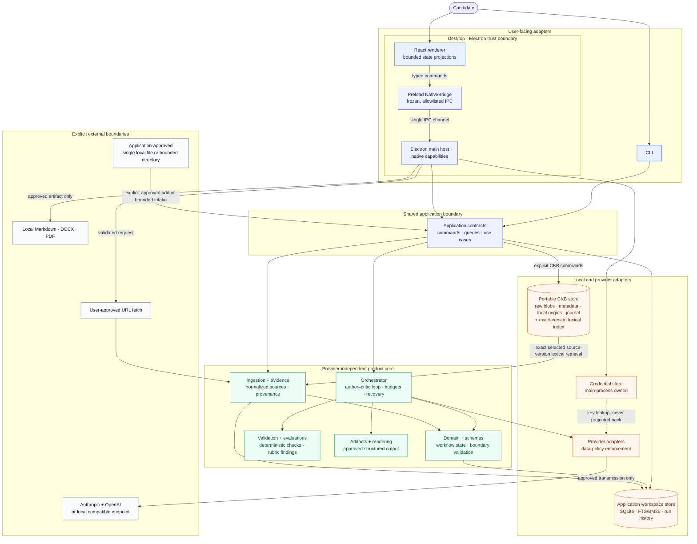

# Architecture

DraftLoop is a local-first, multi-model drafting and review workspace. The
first artifact is a job-specific CV, but the contracts are shaped around a
reusable workflow: canonical requirements and evidence produce an artifact,
an independent critic evaluates it, and a human approves the result.

## Boundaries

Solid arrows show application data or control flow. The dotted credential edge
is lookup-only: stored keys are never projected to the renderer. Network and
export edges require visible approval. The solid CKB edge covers the explicit
file, URL, and bounded-directory commands documented in
[Candidate evidence](candidate-evidence.md). It also represents exact selected
source-version lexical retrieval through the CKB-owned index; selection is
explicit and does not imply implicit workspace access. See the [CKB integration
status](candidate-evidence.md#ckb-integration-status) for remaining limits.

The renderer receives bounded projections for workspace and run state. Native
dialogs, workspace paths, SQLite handles, credential persistence, provider SDK
construction, URL fetching, and export writes remain in the main process. The
renderer can submit an API key only through the allowlisted credential command;
the host validates it and owns encryption, status, removal, and environment
fallback. Browser mode has no native filesystem or persistent credential
capabilities and keeps a deterministic fixture fallback. See [ADR
0004](../adr/0004-desktop-credential-boundary.md).

## Package and data ownership

| Boundary                                         | Owns                                                                                               | Does not own                                                         |
| ------------------------------------------------ | -------------------------------------------------------------------------------------------------- | -------------------------------------------------------------------- |
| `packages/domain` and `packages/schemas`         | Framework-free concepts, workflow states, and Zod validation at persistence/exchange boundaries    | Provider SDKs, storage engines, or UI frameworks                     |
| `packages/ingestion` and `packages/evidence`     | Approved local/URL intake, extraction, normalized material, provenance, and source references      | Application selection or provider transport                          |
| `packages/orchestrator`                          | Author–critic sequencing, budgets, pause/stop, recovery, and user-visible run events through ports | Provider-specific SDK calls                                          |
| `packages/validation` and `packages/evaluations` | Deterministic checks, rubric findings, and structured critique records                             | Proof of truth independent of candidate evidence and human decisions |
| `packages/artifacts` and `packages/rendering`    | Approved structured output and local Markdown/DOCX/PDF rendering                                   | Submission or publishing                                             |
| `packages/storage`                               | Workspace history and portable CKB persistence, including managed bytes and local-only state       | CKB selection, retrieval policy, or UI                               |
| `packages/providers`                             | Provider identity, SDK translation, policy enforcement, and model calls                            | Domain workflow decisions                                            |
| `packages/application`, CLI, and desktop host    | Adapter-neutral use cases and shared user-facing contracts                                         | A second domain layer or provider SDKs in the UI                     |

## Key flow

The CLI and desktop host call the shared application contracts. Those contracts
assemble approved local inputs, selected evidence, and immutable context
snapshots before handing provider-independent work to the orchestrator. The
orchestrator coordinates authoring, independent critique, bounded revision,
deterministic checks, approval, and local export through ports.

The provider adapters are the only model-facing boundary. They enforce the
approved data policy and record provider and model identity. The application
and storage boundaries retain path-free run references, evidence links, typed
findings, artifact history, and user decisions without storing hidden
chain-of-thought or raw provider payloads.

## Data and quality contracts

Retrieval is workspace-scoped behind a provider-independent port. SQLite
FTS/BM25 is the integrated lexical baseline and supplies selected chunks to live
author and critic requests. Local vector and hybrid implementations remain
evaluation components until deletion, retention, isolation, provenance, and
quality are validated for the product path.

[ADR 0008](../adr/0008-ckb-scoped-lexical-retrieval.md) defines the CKB cutover:
each portable store owns its replaceable exact-source-version lexical index,
while the application fans out only across the workspace's explicit selection
and persists content-free retrieval traces in workspace history. The exact
selected projection stays inside the lifecycle boundary that can delete or
rebuild it. Migration 25 supplies the CKB chunk/FTS projection, freshness
inspection, exact-scope query and fallback, whole-projection invalidation on
source-version deletion, and immutable workspace traces. Runs with an explicit
CKB selection provide only opaque chunk references and bounded text to author
and critic; legacy workspaces without a CKB selection keep the earlier
workspace evidence index. CKB selection remains explicit and path-free in run
contexts.

Before evidence reaches the author, bounded supplementary searches reserve
content for required CV sections. If a search limit is reached without
establishing section content, drafting fails visibly because the search cannot
establish absence. Author validation rejects empty sections and unavailable
placeholders when supplied evidence establishes content; missing individual
details may remain explicit.

Author-output validation checks every substantive claim against its cited
evidence. Protected multi-word values stay within one cited chunk, and numbers,
names, and explicit experience contradictions stay protected.

Block text outside substantive claims fails with the content-free
`substantive_text_uncovered` diagnostic, for bounded author retry, when any of
these holds:

- An uncovered content word appears in no retrieved chunk. A short closed list
  of function words, such as articles, prepositions, and connectives, is exempt.
- A protected value in the block is not supported by the chunks its claims cite.
- A date range is not stated with the same start and end in one cited chunk.
- A capitalised single-word name appears in no retrieved chunk.

Headings, labels, and explicit missing-data notices stay exempt. Wording built
only from function words and evidence words is left to critic and human review.

SQLite migration 26 preserves the artifact-history boundary: each immutable
artifact ID may begin its own version-1 lineage, later rows link by parent
version, and dependent run, execution, finding, decision, and export references
remain valid. The migration rebuilds the version table transactionally,
recreates immutable update/delete triggers, and validates the foreign-key graph.
The application checks workspace and context identity, rejects missing or
conflicting ancestors, then projects checksum-verified ancestry from durable
run snapshots parent-first and idempotently before inserting the latest
artifact, including earlier round records. Resume can complete an
already-reviewed projection without another provider call or changing earlier
snapshots.

## Detailed current-system views

This page is the stable external entry point. The detailed views below are the
canonical homes for the current-state material that would otherwise make this
overview a file tour:

- [Candidate evidence](candidate-evidence.md) covers opportunity briefs,
  writing policy enforcement, portable CKB lifecycle, canonical candidate
  profiles, and CKB integration boundaries.
- [Drafting and review](drafting-and-review.md) covers the
  evaluator–optimizer workflow, requirement matching, author grounding,
  independent readiness, adjudication, stopping decisions, and rendering QA.
- [Runtime and trust](runtime-and-trust.md) covers the author–critic loop,
  workflow states, duration accounting, application adapters, provider controls,
  and export boundaries.

## Current limitations

Portable CKB retrieval is explicit and scoped to selected source versions;
index synchronization and lifecycle checks run before results are used. Local
vector and hybrid retrieval remain evaluation components. Rendering QA is
bounded: OOXML cannot establish true office pagination or visual clipping, and
structured links and images are unsupported by the current artifact model.
DraftLoop prepares local artifacts but does not submit applications, publish
documents, send messages, or perform uncontrolled web research.
